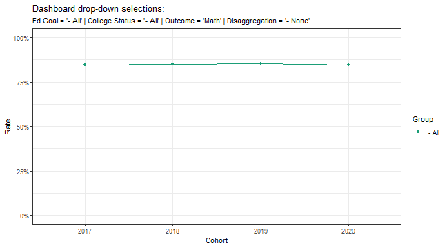
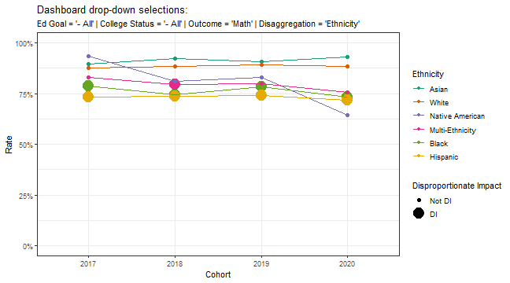
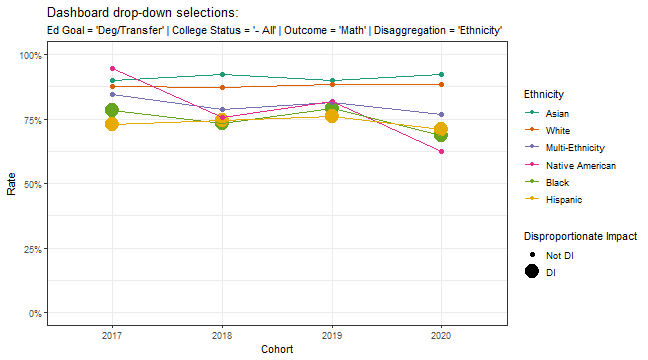
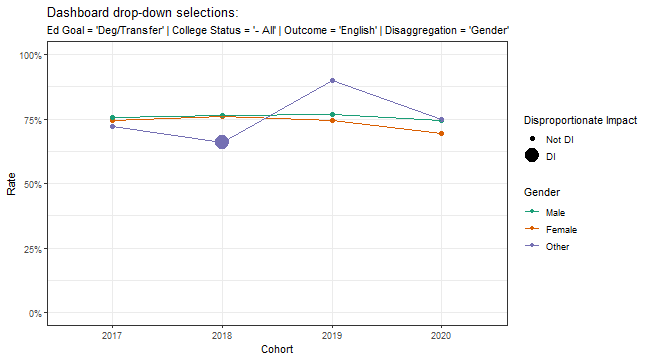

# Introduction

It is often desirable to visualize student success data with the ability to disaggregate by multiple group variables to highlight equity gaps and disproportionate impact (DI) in an interactive dashboard (e.g., Tableau or Power BI).  It is certainly feasible to calculate disproportionate impact on the fly in standard dashboard tools, but doing so:

1. increases development time,
2. increases the likelihood for error in calculations as the code has to be "re-written" for each dashboard, and
3. is more difficult to maintain and support, especially when transitioning projects between analysts.

A suggested workflow is to:

1. start with a student-level data set;
2. call a single function to pre-calculate success rates and disproportionate impact across all levels of disaggregation, cohorts, and scenarios;
3. export the pre-calculated data set;
4. import the pre-calculated data set to the dashboard tool of choice for visualization, where every point visualized is a row from the imported data set.

Using this workflow, one could scale up DI calculations and rapidly develop dashboards with the ability to disaggregate and highlight equity gaps / disproportionate impact for many disaggregation variables, many outcomes, and many scenarios / student populations.

The `DisImpact` package offers the `di_iterate` function that allows one to accomplish step 2 in the suggested workflow.  As of version 0.0.20, the functions `di_iterate_sql` and `di_iterate_dt` were added to support DI calculations on data stored on a database table / [parquet](https://parquet.apache.org/) file and a [data.table](https://CRAN.R-project.org/package=data.table) object, respectively.  These two functions were added to substantially reduce the time needed for DI calculations when there are many scenarios to iterate through, and when the data of interest is *larger-than-memory* (and hence, stored on a parquet file).

# Load `DisImpact` and toy data set

First, load the necessary packages.


```r
library(DisImpact)
library(dplyr) # Ease in manipulations with data frames
```

Second, load a toy data set.


```r
data(student_equity) # provided from DisImpact
dim(student_equity)
```

```
## [1] 20000    24
```

```r
# head(student_equity)
```


Table: A few rows from the `student_equity` data set.

|Ethnicity       |Gender | Cohort| Transfer| Cohort_Math| Math| Cohort_English| English|Ed_Goal      |College_Status     | Student_ID| EthnicityFlag_Asian| EthnicityFlag_Black| EthnicityFlag_Hispanic| EthnicityFlag_NativeAmerican| EthnicityFlag_PacificIslander| EthnicityFlag_White| EthnicityFlag_Carribean| EthnicityFlag_EastAsian| EthnicityFlag_SouthEastAsian| EthnicityFlag_SouthWestAsianNorthAfrican| EthnicityFlag_AANAPI| EthnicityFlag_Unknown| EthnicityFlag_TwoorMoreRaces|
|:---------------|:------|------:|--------:|-----------:|----:|--------------:|-------:|:------------|:------------------|----------:|-------------------:|-------------------:|----------------------:|----------------------------:|-----------------------------:|-------------------:|-----------------------:|-----------------------:|----------------------------:|----------------------------------------:|--------------------:|---------------------:|----------------------------:|
|Native American |Female |   2017|        0|        2017|    1|           2017|       0|Deg/Transfer |First-time College |     100001|                   0|                   0|                      0|                            1|                             0|                   0|                       0|                       0|                            0|                                        0|                    1|                     0|                            0|
|Native American |Female |   2017|        0|        2018|    1|             NA|      NA|Deg/Transfer |First-time College |     100002|                   0|                   0|                      0|                            1|                             0|                   0|                       0|                       0|                            0|                                        0|                    1|                     0|                            0|
|Native American |Female |   2017|        0|        2018|    1|           2017|       0|Deg/Transfer |First-time College |     100003|                   0|                   0|                      0|                            1|                             0|                   0|                       0|                       0|                            0|                                        0|                    1|                     0|                            0|
|Native American |Male   |   2017|        1|        2017|    1|           2018|       1|Other        |First-time College |     100004|                   0|                   0|                      0|                            1|                             0|                   0|                       0|                       0|                            0|                                        0|                    1|                     0|                            0|
|Native American |Male   |   2017|        0|        2017|    1|           2019|       0|Deg/Transfer |Other              |     100005|                   0|                   0|                      0|                            1|                             0|                   0|                       0|                       0|                            0|                                        0|                    1|                     0|                            0|
|Native American |Male   |   2017|        1|        2019|    1|           2018|       1|Other        |First-time College |     100006|                   0|                   0|                      0|                            1|                             0|                   0|                       0|                       0|                            0|                                        0|                    1|                     0|                            0|

To get a description of each variable, type `?student_equity` in the R console.

# Execute `di_iterate` on a data set

Let's illustrate the `di_iterate` function with some key arguments:

- `data`: a data frame of unitary (student) level or summarized data.
- `success_vars`: all outcome variables of interest.
- `group_vars`: all variables to disaggregate by (for calculating equity gaps and disproportionate impact).
- `cohort_vars` (optional): variables defining cohorts, corresponding to those in `success_vars`.
- `scenario_repeat_by_vars` (optional): variables to repeat DI calculations for across all combination of these variables.  Use only if the user is interested in performing a DI analysis for variables in `group_vars` for everyone in `data`, and separately for each combination of subpopulations specified using `scenario_repeat_by_vars`.  Each combination of these variables (e.g., full time, first time college students with an ed goal of degree/transfer as one combination) would constitute an iteration / sample for which to calculate disproportionate impact for outcomes listed in `success_vars` and for the disaggregation variables listed in `group_vars`.

To see the details of these and other arguments, type `?di_iterate` in the R console.


```r
df_di_summary <- di_iterate(data=student_equity
                          , success_vars=c('Math', 'English', 'Transfer')
                          , group_vars=c('Ethnicity', 'Gender')
                          , cohort_vars=c('Cohort_Math', 'Cohort_English', 'Cohort')
                          , scenario_repeat_by_vars=c('Ed_Goal', 'College_Status')
                            )

## df_di_summary <- di_iterate(data=student_equity, success_vars=c('Math', 'English', 'Transfer'), group_vars=c('Ethnicity', 'Gender'), cohort_vars=c('Cohort', 'Cohort', 'Cohort'), scenario_repeat_by_vars=c('Ed_Goal', 'College_Status'))

## df_di_summary <- di_iterate(data=student_equity, success_vars=c('Math', 'English', 'Transfer'), group_vars=c('Ethnicity', 'Gender'), scenario_repeat_by_vars=c('Ed_Goal', 'College_Status'))

## df_di_summary_2 <- di_iterate(data=student_equity, success_vars=c('Math', 'English', 'Transfer'), group_vars=c('Ethnicity', 'Gender'), cohort_vars=c('Cohort_Math', 'Cohort_English', 'Cohort'), scenario_repeat_by_vars=c('Ed_Goal', 'College_Status'), ppg_reference_groups=c('White', 'Male'), di_80_index_reference_groups=c('White', 'Male'))

## df_di_summary <- di_iterate(data=student_equity, success_vars=c('Math', 'English', 'Transfer'), group_vars=c('Ethnicity', 'Gender'), cohort_vars=c('Cohort_Math', 'Cohort_English', 'Cohort'), scenario_repeat_by_vars=c('Ed_Goal', 'College_Status'), ppg_reference_groups=c('all but current'), di_80_index_reference_groups=c('White', 'Male'))
```

# Explore resulting summary data set


```r
dim(df_di_summary)
```

```
## [1] 898  27
```

```r
df_di_summary %>% head %>% as.data.frame # first few rows
```

```
##   Ed_Goal College_Status success_variable cohort_variable cohort disaggregation
## 1   - All          - All          English  Cohort_English   2017         - None
## 2   - All          - All          English  Cohort_English   2017      Ethnicity
## 3   - All          - All          English  Cohort_English   2017      Ethnicity
## 4   - All          - All          English  Cohort_English   2017      Ethnicity
## 5   - All          - All          English  Cohort_English   2017      Ethnicity
## 6   - All          - All          English  Cohort_English   2017      Ethnicity
##             group    n success       pct ppg_reference ppg_reference_group
## 1           - All 5520    4183 0.7577899     0.7577899             overall
## 2           Asian 1689    1430 0.8466548     0.7577899             overall
## 3           Black  559     361 0.6457961     0.7577899             overall
## 4        Hispanic 1056     621 0.5880682     0.7577899             overall
## 5 Multi-Ethnicity  282     207 0.7340426     0.7577899             overall
## 6 Native American   54      35 0.6481481     0.7577899             overall
##          moe    pct_lo    pct_hi di_indicator_ppg success_needed_not_di_ppg
## 1 0.03000000 0.7277899 0.7877899                0                         0
## 2 0.03000000 0.8166548 0.8766548                0                         0
## 3 0.04144958 0.6043465 0.6872456                1                        40
## 4 0.03015742 0.5579108 0.6182256                1                       148
## 5 0.05835815 0.6756844 0.7924007                0                         0
## 6 0.13336111 0.5147870 0.7815093                0                         0
##   success_needed_full_parity_ppg di_prop_index di_indicator_prop_index
## 1                              0     1.0000000                       0
## 2                              0     1.1172686                       0
## 3                             63     0.8522100                       0
## 4                            180     0.7760307                       1
## 5                              7     0.9686624                       0
## 6                              6     0.8553138                       0
##   success_needed_not_di_prop_index success_needed_full_parity_prop_index
## 1                                0                                     0
## 2                                0                                     0
## 3                                0                                    70
## 4                               23                                   222
## 5                                0                                     8
## 6                                0                                     6
##   di_80_index_reference_group di_80_index di_indicator_80_index
## 1                       - All   1.0000000                     0
## 2                       Asian   1.0000000                     0
## 3                       Asian   0.7627619                     1
## 4                       Asian   0.6945784                     1
## 5                       Asian   0.8669915                     0
## 6                       Asian   0.7655400                     1
##   success_needed_not_di_80_index success_needed_full_parity_80_index
## 1                              0                                   0
## 2                              0                                   0
## 3                             18                                 113
## 4                             95                                 274
## 5                              0                                  32
## 6                              2                                  11
```

The variables `di_indicator_ppg`, `di_indicator_prop_index`, and `di_indicator_80_index` are DI flags using the three methods.  For additional explanations on other variables/columns in the returned data set, type `?di_iterate` in the R console to bring up the documentation.

Next, note that the scenario `'- All'` is included for all variables passed to `scenario_repeat_by_vars` by default:

```r
table(df_di_summary$Ed_Goal)
```

```
## 
##        - All Deg/Transfer        Other 
##          300          300          298
```

```r
table(df_di_summary$College_Status)
```

```
## 
##              - All First-time College              Other 
##                300                300                298
```

Also note `di_iterate` returns non-disaggregated results by default (`'- None'` scenario):

```r
table(df_di_summary$disaggregation)
```

```
## 
##    - None Ethnicity    Gender 
##        90       539       269
```

Let's inspect the rows corresponding to non-disaggregated results.


```r
# No Disaggregation
df_di_summary %>%
  filter(Ed_Goal=='- All', College_Status=='- All', disaggregation=='- None') %>%
  as.data.frame
```

|Ed_Goal |College_Status |success_variable |cohort_variable | cohort|disaggregation |group |     n| success|       pct| ppg_reference|ppg_reference_group |       moe|    pct_lo|    pct_hi| di_indicator_ppg| success_needed_not_di_ppg| success_needed_full_parity_ppg| di_prop_index| di_indicator_prop_index| success_needed_not_di_prop_index| success_needed_full_parity_prop_index|di_80_index_reference_group | di_80_index| di_indicator_80_index| success_needed_not_di_80_index| success_needed_full_parity_80_index|
|:-------|:--------------|:----------------|:---------------|------:|:--------------|:-----|-----:|-------:|---------:|-------------:|:-------------------|---------:|---------:|---------:|----------------:|-------------------------:|------------------------------:|-------------:|-----------------------:|--------------------------------:|-------------------------------------:|:---------------------------|-----------:|---------------------:|------------------------------:|-----------------------------------:|
|- All   |- All          |English          |Cohort_English  |   2017|- None         |- All |  5520|    4183| 0.7577899|     0.7577899|overall             | 0.0300000| 0.7277899| 0.7877899|                0|                         0|                              0|             1|                       0|                                0|                                     0|- All                       |           1|                     0|                              0|                                   0|
|- All   |- All          |English          |Cohort_English  |   2018|- None         |- All |  8543|    6532| 0.7646026|     0.7646026|overall             | 0.0300000| 0.7346026| 0.7946026|                0|                         0|                              0|             1|                       0|                                0|                                     0|- All                       |           1|                     0|                              0|                                   0|
|- All   |- All          |English          |Cohort_English  |   2019|- None         |- All |  3866|    2938| 0.7599586|     0.7599586|overall             | 0.0300000| 0.7299586| 0.7899586|                0|                         0|                              0|             1|                       0|                                0|                                     0|- All                       |           1|                     0|                              0|                                   0|
|- All   |- All          |English          |Cohort_English  |   2020|- None         |- All |   913|     678| 0.7426068|     0.7426068|overall             | 0.0324333| 0.7101735| 0.7750401|                0|                         0|                              0|             1|                       0|                                0|                                     0|- All                       |           1|                     0|                              0|                                   0|
|- All   |- All          |Math             |Cohort_Math     |   2017|- None         |- All |  4398|    3722| 0.8462938|     0.8462938|overall             | 0.0300000| 0.8162938| 0.8762938|                0|                         0|                              0|             1|                       0|                                0|                                     0|- All                       |           1|                     0|                              0|                                   0|
|- All   |- All          |Math             |Cohort_Math     |   2018|- None         |- All |  7295|    6193| 0.8489376|     0.8489376|overall             | 0.0300000| 0.8189376| 0.8789376|                0|                         0|                              0|             1|                       0|                                0|                                     0|- All                       |           1|                     0|                              0|                                   0|
|- All   |- All          |Math             |Cohort_Math     |   2019|- None         |- All |  4456|    3807| 0.8543537|     0.8543537|overall             | 0.0300000| 0.8243537| 0.8843537|                0|                         0|                              0|             1|                       0|                                0|                                     0|- All                       |           1|                     0|                              0|                                   0|
|- All   |- All          |Math             |Cohort_Math     |   2020|- None         |- All |  1780|    1505| 0.8455056|     0.8455056|overall             | 0.0300000| 0.8155056| 0.8755056|                0|                         0|                              0|             1|                       0|                                0|                                     0|- All                       |           1|                     0|                              0|                                   0|
|- All   |- All          |Transfer         |Cohort          |   2017|- None         |- All | 10000|    5140| 0.5140000|     0.5140000|overall             | 0.0300000| 0.4840000| 0.5440000|                0|                         0|                              0|             1|                       0|                                0|                                     0|- All                       |           1|                     0|                              0|                                   0|
|- All   |- All          |Transfer         |Cohort          |   2018|- None         |- All | 10000|    5388| 0.5388000|     0.5388000|overall             | 0.0300000| 0.5088000| 0.5688000|                0|                         0|                              0|             1|                       0|                                0|                                     0|- All                       |           1|                     0|                              0|                                   0|

# Visualization (emulating dashboard features)

In this section, we emulate what a dashboard could visualize.

Imagine a dashboard with the following dropdown menus and option values:

- Ed Goal
  + '- All'
  + 'Degree/Transfer'
  + 'Other'
- College Status
  + '- All'
  + 'First-time college'
  + 'Other'
- Outcome:
  + 'Transfer'
  + 'Math'
  + 'English'
- Disaggregation:
  + '- None'
  + 'Ethnicity'
  + 'Gender'

Each combination of this set of dropdown menus could be visualized using a subset of rows in `df_di_summary`.

For example, let's visualize non-disaggregated results for math (the dropdown selections are described at the top of the visualization):

```r
# No Disaggregation
df_di_summary %>%
  filter(Ed_Goal=='- All', College_Status=='- All', success_variable=='Math', disaggregation=='- None') %>%
  as.data.frame
```

```
##   Ed_Goal College_Status success_variable cohort_variable cohort disaggregation
## 1   - All          - All             Math     Cohort_Math   2017         - None
## 2   - All          - All             Math     Cohort_Math   2018         - None
## 3   - All          - All             Math     Cohort_Math   2019         - None
## 4   - All          - All             Math     Cohort_Math   2020         - None
##   group    n success       pct ppg_reference ppg_reference_group  moe    pct_lo
## 1 - All 4398    3722 0.8462938     0.8462938             overall 0.03 0.8162938
## 2 - All 7295    6193 0.8489376     0.8489376             overall 0.03 0.8189376
## 3 - All 4456    3807 0.8543537     0.8543537             overall 0.03 0.8243537
## 4 - All 1780    1505 0.8455056     0.8455056             overall 0.03 0.8155056
##      pct_hi di_indicator_ppg success_needed_not_di_ppg
## 1 0.8762938                0                         0
## 2 0.8789376                0                         0
## 3 0.8843537                0                         0
## 4 0.8755056                0                         0
##   success_needed_full_parity_ppg di_prop_index di_indicator_prop_index
## 1                              0             1                       0
## 2                              0             1                       0
## 3                              0             1                       0
## 4                              0             1                       0
##   success_needed_not_di_prop_index success_needed_full_parity_prop_index
## 1                                0                                     0
## 2                                0                                     0
## 3                                0                                     0
## 4                                0                                     0
##   di_80_index_reference_group di_80_index di_indicator_80_index
## 1                       - All           1                     0
## 2                       - All           1                     0
## 3                       - All           1                     0
## 4                       - All           1                     0
##   success_needed_not_di_80_index success_needed_full_parity_80_index
## 1                              0                                   0
## 2                              0                                   0
## 3                              0                                   0
## 4                              0                                   0
```

```r
library(ggplot2)
library(forcats)
library(scales)

# No Disaggregation
df_di_summary %>%
  filter(Ed_Goal=='- All', College_Status=='- All', success_variable=='Math', disaggregation=='- None') %>%
  select(cohort, group, n, pct, di_indicator_ppg, di_indicator_prop_index, di_indicator_80_index) %>%
  mutate(group=factor(group) %>% fct_reorder(desc(pct))) %>% 
  ggplot(data=., mapping=aes(x=factor(cohort), y=pct, group=group, color=group)) +
  geom_point() +
  geom_line() +
  xlab('Cohort') +
  ylab('Rate') +
  theme_bw() +
  scale_color_manual(values=c('#1b9e77'), name='Group') +
                                      # labs(size='Disproportionate Impact') +
scale_y_continuous(labels = percent, limits=c(0, 1)) +
  ggtitle('Dashboard drop-down selections:', subtitle=paste0("Ed Goal = '- All' | College Status = '- All' | Outcome = 'Math' | Disaggregation = '- None'"))
```



In this dashboard, one could choose to disaggregate by ethnicity and highlight disproportionate impact (for simplicity, let's use the percentage point gap method, or the `di_indicator_ppg` flag in subsequent visualizations):

```r
# Disaggregation: Ethnicity
df_di_summary %>%
  filter(Ed_Goal=='- All', College_Status=='- All', success_variable=='Math', disaggregation=='Ethnicity') %>%
  select(cohort, group, n, pct, di_indicator_ppg, di_indicator_prop_index, di_indicator_80_index) %>%
  as.data.frame
```

```
##    cohort           group    n       pct di_indicator_ppg
## 1    2017           Asian 1406 0.8968706                0
## 2    2017           Black  421 0.7862233                1
## 3    2017        Hispanic  815 0.7325153                1
## 4    2017 Multi-Ethnicity  211 0.8293839                0
## 5    2017 Native American   45 0.9333333                0
## 6    2017           White 1500 0.8773333                0
## 7    2018           Asian 2212 0.9235986                0
## 8    2018           Black  684 0.7441520                1
## 9    2018        Hispanic 1386 0.7366522                1
## 10   2018 Multi-Ethnicity  369 0.7940379                1
## 11   2018 Native American   68 0.8088235                0
## 12   2018           White 2576 0.8819876                0
## 13   2019           Asian 1429 0.9083275                0
## 14   2019           Black  411 0.7834550                1
## 15   2019        Hispanic  786 0.7404580                1
## 16   2019 Multi-Ethnicity  225 0.8000000                0
## 17   2019 Native American   47 0.8297872                0
## 18   2019           White 1558 0.8896021                0
## 19   2020           Asian  573 0.9301920                0
## 20   2020           Black  180 0.7333333                1
## 21   2020        Hispanic  304 0.7171053                1
## 22   2020 Multi-Ethnicity   99 0.7575758                0
## 23   2020 Native American   14 0.6428571                0
## 24   2020           White  610 0.8819672                0
##    di_indicator_prop_index di_indicator_80_index
## 1                        0                     0
## 2                        0                     0
## 3                        0                     1
## 4                        0                     0
## 5                        0                     0
## 6                        0                     0
## 7                        0                     0
## 8                        0                     0
## 9                        0                     1
## 10                       0                     0
## 11                       0                     0
## 12                       0                     0
## 13                       0                     0
## 14                       0                     0
## 15                       0                     0
## 16                       0                     0
## 17                       0                     0
## 18                       0                     0
## 19                       0                     0
## 20                       0                     1
## 21                       0                     1
## 22                       0                     0
## 23                       1                     1
## 24                       0                     0
```

```r
# Disaggregation: Ethnicity
df_di_summary %>%
  filter(Ed_Goal=='- All', College_Status=='- All', success_variable=='Math', disaggregation=='Ethnicity') %>%
  select(cohort, group, n, pct, di_indicator_ppg, di_indicator_prop_index, di_indicator_80_index) %>%
  mutate(group=factor(group) %>% fct_reorder(desc(pct))) %>% 
  ggplot(data=., mapping=aes(x=factor(cohort), y=pct, group=group, color=group)) +
  geom_point(aes(size=factor(di_indicator_ppg, levels=c(0, 1), labels=c('Not DI', 'DI')))) +
  geom_line() +
  xlab('Cohort') +
  ylab('Rate') +
  theme_bw() +
  scale_color_manual(values=c('#1b9e77', '#d95f02', '#7570b3', '#e7298a', '#66a61e', '#e6ab02'), name='Ethnicity') +
  labs(size='Disproportionate Impact') +
  scale_y_continuous(labels = percent, limits=c(0, 1)) +
  ggtitle('Dashboard drop-down selections:', subtitle=paste0("Ed Goal = '- All' | College Status = '- All' | Outcome = 'Math' | Disaggregation = 'Ethnicity'"))
```

```
## Warning: Using size for a discrete variable is not advised.
```



In a dashboard, the user might be interested in focusing on degree/transfer students.  We emulate this by filtering on `Ed_Goal=='Deg/Transer'`:

```r
# Disaggregation: Ethnicity; Deg/Transfer
df_di_summary %>%
  filter(Ed_Goal=='Deg/Transfer', College_Status=='- All', success_variable=='Math', disaggregation=='Ethnicity') %>%
  select(cohort, group, n, pct, di_indicator_ppg, di_indicator_prop_index, di_indicator_80_index) %>%
  as.data.frame
```

```
##    cohort           group    n       pct di_indicator_ppg
## 1    2017           Asian  975 0.8984615                0
## 2    2017           Black  290 0.7827586                1
## 3    2017        Hispanic  591 0.7292724                1
## 4    2017 Multi-Ethnicity  148 0.8445946                0
## 5    2017 Native American   36 0.9444444                0
## 6    2017           White 1039 0.8748797                0
## 7    2018           Asian 1552 0.9233247                0
## 8    2018           Black  478 0.7322176                1
## 9    2018        Hispanic  988 0.7439271                1
## 10   2018 Multi-Ethnicity  246 0.7886179                0
## 11   2018 Native American   45 0.7555556                0
## 12   2018           White 1829 0.8737015                0
## 13   2019           Asian  972 0.8971193                0
## 14   2019           Black  302 0.7913907                1
## 15   2019        Hispanic  556 0.7607914                1
## 16   2019 Multi-Ethnicity  162 0.8148148                0
## 17   2019 Native American   33 0.8181818                0
## 18   2019           White 1081 0.8843663                0
## 19   2020           Asian  402 0.9203980                0
## 20   2020           Black  127 0.6850394                1
## 21   2020        Hispanic  204 0.7107843                1
## 22   2020 Multi-Ethnicity   69 0.7681159                0
## 23   2020 Native American    8 0.6250000                0
## 24   2020           White  418 0.8851675                0
##    di_indicator_prop_index di_indicator_80_index
## 1                        0                     0
## 2                        0                     0
## 3                        0                     1
## 4                        0                     0
## 5                        0                     0
## 6                        0                     0
## 7                        0                     0
## 8                        0                     1
## 9                        0                     0
## 10                       0                     0
## 11                       0                     0
## 12                       0                     0
## 13                       0                     0
## 14                       0                     0
## 15                       0                     0
## 16                       0                     0
## 17                       0                     0
## 18                       0                     0
## 19                       0                     0
## 20                       0                     1
## 21                       0                     1
## 22                       0                     0
## 23                       1                     1
## 24                       0                     0
```

```r
# Disaggregation: Ethnicity; Deg/Transfer
df_di_summary %>%
  filter(Ed_Goal=='Deg/Transfer', College_Status=='- All', success_variable=='Math', disaggregation=='Ethnicity') %>%
  select(cohort, group, n, pct, di_indicator_ppg, di_indicator_prop_index, di_indicator_80_index) %>%
  mutate(group=factor(group) %>% fct_reorder(desc(pct))) %>% 
  ggplot(data=., mapping=aes(x=factor(cohort), y=pct, group=group, color=group)) +
  geom_point(aes(size=factor(di_indicator_ppg, levels=c(0, 1), labels=c('Not DI', 'DI')))) +
  geom_line() +
  xlab('Cohort') +
  ylab('Rate') +
  theme_bw() +
  scale_color_manual(values=c('#1b9e77', '#d95f02', '#7570b3', '#e7298a', '#66a61e', '#e6ab02'), name='Ethnicity') +
  labs(size='Disproportionate Impact') +
  scale_y_continuous(labels = percent, limits=c(0, 1)) +
  ggtitle('Dashboard drop-down selections:', subtitle=paste0("Ed Goal = 'Deg/Transfer' | College Status = '- All' | Outcome = 'Math' | Disaggregation = 'Ethnicity'"))
```

```
## Warning: Using size for a discrete variable is not advised.
```



In a dashboard, the user could switch the outcome to English and disaggregate by Gender:

```r
# Disaggregation: Gender; Deg/Transfer; English
df_di_summary %>%
  filter(Ed_Goal=='Deg/Transfer', College_Status=='- All', success_variable=='English', disaggregation=='Gender') %>%
  as.data.frame
```

```
##         Ed_Goal College_Status success_variable cohort_variable cohort
## 1  Deg/Transfer          - All          English  Cohort_English   2017
## 2  Deg/Transfer          - All          English  Cohort_English   2017
## 3  Deg/Transfer          - All          English  Cohort_English   2017
## 4  Deg/Transfer          - All          English  Cohort_English   2018
## 5  Deg/Transfer          - All          English  Cohort_English   2018
## 6  Deg/Transfer          - All          English  Cohort_English   2018
## 7  Deg/Transfer          - All          English  Cohort_English   2019
## 8  Deg/Transfer          - All          English  Cohort_English   2019
## 9  Deg/Transfer          - All          English  Cohort_English   2019
## 10 Deg/Transfer          - All          English  Cohort_English   2020
## 11 Deg/Transfer          - All          English  Cohort_English   2020
## 12 Deg/Transfer          - All          English  Cohort_English   2020
##    disaggregation  group    n success       pct ppg_reference
## 1          Gender Female 1916    1424 0.7432150     0.7496751
## 2          Gender   Male 1863    1411 0.7573806     0.7496751
## 3          Gender  Other   68      49 0.7205882     0.7496751
## 4          Gender Female 2833    2151 0.7592658     0.7597185
## 5          Gender   Male 3003    2296 0.7645688     0.7597185
## 6          Gender  Other  132      87 0.6590909     0.7597185
## 7          Gender Female 1385    1032 0.7451264     0.7577753
## 8          Gender   Male 1308    1003 0.7668196     0.7577753
## 9          Gender  Other   40      36 0.9000000     0.7577753
## 10         Gender Female  307     213 0.6938111     0.7192429
## 11         Gender   Male  315     234 0.7428571     0.7192429
## 12         Gender  Other   12       9 0.7500000     0.7192429
##    ppg_reference_group        moe    pct_lo    pct_hi di_indicator_ppg
## 1              overall 0.03000000 0.7132150 0.7732150                0
## 2              overall 0.03000000 0.7273806 0.7873806                0
## 3              overall 0.11884246 0.6017458 0.8394307                0
## 4              overall 0.03000000 0.7292658 0.7892658                0
## 5              overall 0.03000000 0.7345688 0.7945688                0
## 6              overall 0.08529805 0.5737929 0.7443890                1
## 7              overall 0.03000000 0.7151264 0.7751264                0
## 8              overall 0.03000000 0.7368196 0.7968196                0
## 9              overall 0.15495161 0.7450484 1.0549516                0
## 10             overall 0.05593155 0.6378795 0.7497426                0
## 11             overall 0.05521674 0.6876404 0.7980739                0
## 12             overall 0.28290163 0.4670984 1.0329016                0
##    success_needed_not_di_ppg success_needed_full_parity_ppg di_prop_index
## 1                          0                             13     0.9913829
## 2                          0                              0     1.0102784
## 3                          0                              2     0.9612007
## 4                          0                              2     0.9994041
## 5                          0                              0     1.0063843
## 6                          3                             14     0.8675462
## 7                          0                             18     0.9833077
## 8                          0                              0     1.0119352
## 9                          0                              0     1.1876871
## 10                         0                              8     0.9646408
## 11                         0                              0     1.0328321
## 12                         0                              0     1.0427632
##    di_indicator_prop_index success_needed_not_di_prop_index
## 1                        0                                0
## 2                        0                                0
## 3                        0                                0
## 4                        0                                0
## 5                        0                                0
## 6                        0                                0
## 7                        0                                0
## 8                        0                                0
## 9                        0                                0
## 10                       0                                0
## 11                       0                                0
## 12                       0                                0
##    success_needed_full_parity_prop_index di_80_index_reference_group
## 1                                     25                        Male
## 2                                      0                        Male
## 3                                      3                        Male
## 4                                      3                        Male
## 5                                      0                        Male
## 6                                     14                        Male
## 7                                     36                       Other
## 8                                      0                       Other
## 9                                      0                       Other
## 10                                    16                       Other
## 11                                     0                       Other
## 12                                     0                       Other
##    di_80_index di_indicator_80_index success_needed_not_di_80_index
## 1    0.9812967                     0                              0
## 2    1.0000000                     0                              0
## 3    0.9514216                     0                              0
## 4    0.9930641                     0                              0
## 5    1.0000000                     0                              0
## 6    0.8620427                     0                              0
## 7    0.8279182                     0                              0
## 8    0.8520217                     0                              0
## 9    1.0000000                     0                              0
## 10   0.9250814                     0                              0
## 11   0.9904762                     0                              0
## 12   1.0000000                     0                              0
##    success_needed_full_parity_80_index
## 1                                   28
## 2                                    0
## 3                                    3
## 4                                   16
## 5                                    0
## 6                                   14
## 7                                  215
## 8                                  175
## 9                                    0
## 10                                  18
## 11                                   3
## 12                                   0
```

```r
# Disaggregation: Gender; Deg/Transfer; English
df_di_summary %>%
  filter(Ed_Goal=='Deg/Transfer', College_Status=='- All', success_variable=='English', disaggregation=='Gender') %>%
  select(cohort, group, n, pct, di_indicator_ppg, di_indicator_prop_index, di_indicator_80_index) %>%
  mutate(group=factor(group) %>% fct_reorder(desc(pct))) %>% 
  ggplot(data=., mapping=aes(x=factor(cohort), y=pct, group=group, color=group)) +
  geom_point(aes(size=factor(di_indicator_ppg, levels=c(0, 1), labels=c('Not DI', 'DI')))) +
  geom_line() +
  xlab('Cohort') +
  ylab('Rate') +
  theme_bw() +
  scale_color_manual(values=c('#1b9e77', '#d95f02', '#7570b3', '#e7298a', '#66a61e', '#e6ab02'), name='Gender') +
  labs(size='Disproportionate Impact') +
  scale_y_continuous(labels = percent, limits=c(0, 1)) +
  ggtitle('Dashboard drop-down selections:', subtitle=paste0("Ed Goal = 'Deg/Transfer' | College Status = '- All' | Outcome = 'English' | Disaggregation = 'Gender'"))
```

```
## Warning: Using size for a discrete variable is not advised.
```



# What is the difference between `group_vars` and `scenario_repeat_by_vars`?

For different classification variables, (e.g., age group, full time status, and education goal), the user might be confused as to whether to pass these into the `group_vars` argument or the `scenario_repeat_by_vars` argument.  The answer is it depends on what the user wants to analyze.  If we think of a single student population of interest (e.g., the data set being passed to `di_iterate` such as all students enrolled at the institution), then the user should pass into `group_vars` all variables that they are *interested in disaggregating on and performing a DI analysis* (e.g., are there disparity among ethnic student groups?  First generation students?).  The `group_vars` argument is required.

On the other hand, the `scenario_repeat_by_vars` argument is optional, and when not specified, the DI analysis is performed on all outcomes specified in `success_vars` and all disaggregation variables specified in `group_vars`, using all students passed to `data` as a single population.  The user should only pass variables into `scenario_repeat_by_vars` if they want to split the student population into multiple subpopulations to perform DI analysis on.  For example, if ethnicity, first generation status, and age group and were specified in `group_vars`, then the user is trying to answer the following questions:

1. Is there disparity between different ethnic student groups?
2. Is there disparity between first generation students vs. non-first generation students?
3. Is there disparity between students of different age groups?

If on the other hand, the user passes ethnicity and first generation status to `group_vars`, and age group to `scenario_repeat_by_vars`, then the user is trying to answer the following questions:

1. Is there disparity between different ethnic student groups?
   a. Among all students defined by `data`?
   b. Among different subpopulations defined by age group?  (e.g., among each of these groups: 18-21, 22-25, 26-35, 35-50, 51+)
2. Is there disparity between first generation students vs. non-first generation students?
   a. Among all students defined by `data`?
   b. Among different subpopulations defined by age group?  (e.g., among each of these groups: 18-21, 22-25, 26-35, 35-50, 51+)

# Understanding the default parameters in `di_iterate`, and overriding them

The function `di_iterate` has been designed to be highly flexible through the use of function arguments / parameters, with many defaults:

```r
args(di_iterate)
```

```
## function (data, success_vars, group_vars, cohort_vars = NULL, 
##     scenario_repeat_by_vars = NULL, exclude_scenario_df = NULL, 
##     weight_var = NULL, include_non_disagg_results = TRUE, ppg_reference_groups = "overall", 
##     min_moe = 0.03, use_prop_in_moe = FALSE, prop_sub_0 = 0.5, 
##     prop_sub_1 = 0.5, di_prop_index_cutoff = 0.8, di_80_index_cutoff = 0.8, 
##     di_80_index_reference_groups = "hpg", check_valid_reference = TRUE, 
##     parallel = FALSE, parallel_n_cores = parallel::detectCores(), 
##     parallel_split_to_disk = FALSE) 
## NULL
```

In this section, we illustrate how each argument could be used.  Type `?di_iterate` to read the description of each.

## Passing a summarized data set to `data` and using `weight_var`

Instead of passing in a student level data set, the user could also pass in a summarized data set, which saves space on your disk drive or in memory when imported into R.  When passing a summarized data set, the user should also specify `weight_var` to indicate the group size of each row.  Let's illustrate with an example:


```r
dim(student_equity)
```

```
## [1] 20000    24
```

```r
## Example summarized data set
student_equity_summ <- student_equity %>%
  group_by(Ethnicity, Gender, Cohort, Cohort_Math, Cohort_English, Ed_Goal, College_Status, Math, English, Transfer) %>% # Math, English, Transfer can take on values 0, 1, NA
  summarize(N=n() %>% as.numeric # not needed, for all.equal()
            ) %>%
  ungroup %>%
  mutate(Math=Math*N, English=English*N, Transfer=Transfer*N) # So that Math, English, and Transfer represent counts
```

```
## `summarise()` has grouped output by 'Ethnicity', 'Gender', 'Cohort', 'Cohort_Math', 'Cohort_English', 'Ed_Goal', 'College_Status', 'Math', 'English'. You can override using the `.groups` argument.
```

```r
dim(student_equity_summ) # same number of columns, less number of rows
```

```
## [1] 3454   11
```

```r
student_equity_summ %>% head %>% as.data.frame # first few rows
```

```
##   Ethnicity Gender Cohort Cohort_Math Cohort_English      Ed_Goal
## 1     Asian Female   2017        2017           2017 Deg/Transfer
## 2     Asian Female   2017        2017           2017 Deg/Transfer
## 3     Asian Female   2017        2017           2017 Deg/Transfer
## 4     Asian Female   2017        2017           2017 Deg/Transfer
## 5     Asian Female   2017        2017           2017 Deg/Transfer
## 6     Asian Female   2017        2017           2017 Deg/Transfer
##       College_Status Math English Transfer   N
## 1 First-time College    0       0        0   9
## 2 First-time College    0       8        0   8
## 3 First-time College   15       0        0  15
## 4 First-time College   13      13        0  13
## 5 First-time College  157     157      157 157
## 6              Other    0       3        0   3
```

```r
## Run on summarized data set
df_di_summary_2 <- di_iterate(data=student_equity_summ
                          , success_vars=c('Math', 'English', 'Transfer')
                          , group_vars=c('Ethnicity', 'Gender')
                          , cohort_vars=c('Cohort_Math', 'Cohort_English', 'Cohort')
                          , scenario_repeat_by_vars=c('Ed_Goal', 'College_Status')
                          , weight_var='N' # SET THIS
                            )
dim(df_di_summary)  ## original results
```

```
## [1] 898  27
```

```r
dim(df_di_summary_2)
```

```
## [1] 898  27
```

```r
all.equal(df_di_summary
        , df_di_summary_2 %>% filter(!is.na(cohort))
          ) # returned results are the same
```

```
## [1] TRUE
```

## Suppress non-disaggregated results using `include_non_disagg_results`

By default, the non-disaggregated results are also returned.  If the user wants to suppress this, they could set `include_non_disagg_results=FALSE`:


```r
df_di_summary_2 <- di_iterate(data=student_equity
                          , success_vars=c('Math', 'English', 'Transfer')
                          , group_vars=c('Ethnicity', 'Gender')
                          , cohort_vars=c('Cohort_Math', 'Cohort_English', 'Cohort')
                          , scenario_repeat_by_vars=c('Ed_Goal', 'College_Status')
                          , include_non_disagg_results=FALSE ## SET THIS
                            )
dim(df_di_summary)
```

```
## [1] 898  27
```

```r
dim(df_di_summary_2) ## less rows because no longer have disaggregated results
```

```
## [1] 808  27
```

```r
table(df_di_summary$disaggregation)
```

```
## 
##    - None Ethnicity    Gender 
##        90       539       269
```

```r
table(df_di_summary_2$disaggregation) # No more '- None'
```

```
## 
## Ethnicity    Gender 
##       539       269
```

## PPG reference groups and other parameters

For the percentage point gap (PPG) method, `di_iterate` defaults to using the overall success rate as the reference for comparison (`ppg_reference_groups='overall'`).  The user could set `ppg_reference_groups='hpg'` to use the highest performing group as the comparison group, or `ppg_reference_groups='all but current'` for using the combined success rate of all other groups excluding the group of interest (e.g., if studying Hispanic students, then the reference group would be all non-Hispanic students).  The latter is sometimes referred to as "PPG minus 1" or "PPG-1."  The user could also specify specific groups as reference:


```r
# Highest performing group as reference
df_di_summary_2 <- di_iterate(data=student_equity
                            , success_vars=c('Math', 'English', 'Transfer')
                            , group_vars=c('Ethnicity', 'Gender')
                            , cohort_vars=c('Cohort_Math', 'Cohort_English', 'Cohort')
                            , scenario_repeat_by_vars=c('Ed_Goal', 'College_Status')
                            , ppg_reference_groups='hpg' ## SET THIS
                              )

# Reference: all other groups except group of interest (PPG minus 1)
df_di_summary_2 <- di_iterate(data=student_equity
                            , success_vars=c('Math', 'English', 'Transfer')
                            , group_vars=c('Ethnicity', 'Gender')
                            , cohort_vars=c('Cohort_Math', 'Cohort_English', 'Cohort')
                            , scenario_repeat_by_vars=c('Ed_Goal', 'College_Status')
                            , ppg_reference_groups='all but current' ## SET THIS
                              )

# Reference: custom groups
df_di_summary_2 <- di_iterate(data=student_equity
                            , success_vars=c('Math', 'English', 'Transfer')
                            , group_vars=c('Ethnicity', 'Gender')
                            , cohort_vars=c('Cohort_Math', 'Cohort_English', 'Cohort')
                            , scenario_repeat_by_vars=c('Ed_Goal', 'College_Status')
                            , ppg_reference_groups=c('White', 'Male') ## corresponds to each variable in group_vars
                              )
```

The following arguments apply to the PPG: `min_moe`, `use_prop_in_moe`, `prop_sub_0`, `prop_sub_1`, and `use_prop_in_moe`.  See `?di_ppg` for more details.

## Proportionality index DI threshold

For the proportionality index (PI) method, DI is determined using `di_prop_index_cutoff=0.8` by default.  This could be changed using the `di_prop_index_cutoff` argument.


```r
df_di_summary_2 <- di_iterate(data=student_equity
                            , success_vars=c('Math', 'English', 'Transfer')
                            , group_vars=c('Ethnicity', 'Gender')
                            , cohort_vars=c('Cohort_Math', 'Cohort_English', 'Cohort')
                            , scenario_repeat_by_vars=c('Ed_Goal', 'College_Status')
                            , di_prop_index_cutoff=0.9 # Easier to declare DI using PI
                              )
```

## 80% index reference groups and DI threshold

For the 80% index method, the highest performing group is used as reference by default (`di_80_index_reference_groups='hpg'`).  Similar to the PPG, the user could specify custom reference groups.


```r
# Custom reference groups
df_di_summary_2 <- di_iterate(data=student_equity
                            , success_vars=c('Math', 'English', 'Transfer')
                            , group_vars=c('Ethnicity', 'Gender')
                            , cohort_vars=c('Cohort_Math', 'Cohort_English', 'Cohort')
                            , scenario_repeat_by_vars=c('Ed_Goal', 'College_Status')
                            , di_80_index_reference_groups=c('White', 'Male') ## corresponds to each variable in group_vars
                              )
```

Besides specifying a specific reference group, the function also acccepts `'overall'` and `'all but current'`.  The former uses the overall success rate as reference for comparison.  The latter uses the combined success rate of all other groups as reference for comparison.

The 80% index uses 80% as the default threshold for declaring DI.  The user could alter this with the `di_80_index_cutoff` argument.


```r
df_di_summary_2 <- di_iterate(data=student_equity
                            , success_vars=c('Math', 'English', 'Transfer')
                            , group_vars=c('Ethnicity', 'Gender')
                            , cohort_vars=c('Cohort_Math', 'Cohort_English', 'Cohort')
                            , scenario_repeat_by_vars=c('Ed_Goal', 'College_Status')
                            , di_80_index_cutoff=0.5 # Harder to declare DI using 80% index
                              )
```

# Multiple PPG or DI parameter scenarios in results

In a single call of `di_iterate`, the results of all three DI methods are returned in one run.  If the user is interested in doing DI calculations using various scenarios of the same method (e.g., using the overall rate as reference for PPG, and using a pre-specified list of reference rates), then it is recommended that the user execute `di_iterate` multiple times and combining the results (stacking).  If the user chooses to do this, then it is a good idea to set `include_non_disagg_results=FALSE` in subsequent `di_iterate` runs to not duplicate rows of non-disaggregated results.


```r
# Multiple group variables and different reference groups
df_di_summary_long <- bind_rows(
  di_iterate(data=student_equity
           , success_vars=c('Math', 'English', 'Transfer')
           , group_vars=c('Ethnicity', 'Gender')
           , cohort_vars=c('Cohort_Math', 'Cohort_English', 'Cohort')
           , scenario_repeat_by_vars=c('Ed_Goal', 'College_Status')
             )
  , di_iterate(data=student_equity
           , success_vars=c('Math', 'English', 'Transfer')
           , group_vars=c('Ethnicity', 'Gender')
           , cohort_vars=c('Cohort_Math', 'Cohort_English', 'Cohort')
           , scenario_repeat_by_vars=c('Ed_Goal', 'College_Status')
           , ppg_reference_groups=c('White', 'Male') ## corresponds to each variable in group_vars
           , include_non_disagg_results = FALSE # Already have non-disaggregated results in the first run
             )
)

dim(df_di_summary_long)
```

```
## [1] 1706   27
```

# FERPA block / suppression

Since `di_iterate` disaggregates on many variables and subpopulations, it is not uncommon the returned results contain rows summarizing small samples.  As is common in education research, care should be taken to not unintentionally disclose the educational outcomes of students (results linked to particular students, ie, FERPA regulation).  The user might want to filter out rows with small samples (e.g., `n < 10`):

```r
## df_di_summary %>%
##   mutate(FERPA_Block=ifelse(n < 10, 1, 0)) %>%
##   filter(FERPA_Block == 0)
```

# Suppress / disable "`Joining, by`" messages

The `di_iterate` function joins various data sets using `dplyr` in the course of calculating DI.  As such, the implicit join's are reported in the R console by various lines starting with `Joining, by =`.  For runs with many scenarios, this may be overwhelming.  To suppress these messages, the user could wrap / pipe the `di_iterate` call with / to the `suppressMessages` function:


```r
df_di_summary <- di_iterate(data=student_equity
                          , success_vars=c('Math', 'English', 'Transfer')
                          , group_vars=c('Ethnicity', 'Gender')
                          , cohort_vars=c('Cohort_Math', 'Cohort_English', 'Cohort')
                          , scenario_repeat_by_vars=c('Ed_Goal', 'College_Status')
                            ) %>%
  suppressMessages
```

# Exclude specific scenarios generated by the use of `scenario_repeat_by_vars`

We saw previously in this vignette how one could leverage the `scenario_repeat_by_vars` argument in `di_iterate` to repeat DI analysis for specific subsets of students.  For example, in a statewide analysis, one could zoom in on specific colleges, and for a collegewide analysis, one could zoom in on specific academic programs/majors.  When multiple variables are passed to `scenario_repeat_by_vars`, the number of scenarios that result from the cartesian product of all the variables specified could be quite large.  Sometimes, specific scenarios are not of interest or not meaningful, and the user may want to exclude these scenarios.  One could go about this by filtering out the unnecessary scenarios after `di_iterate` completes.  However, the execution of the various scenarios could require signficant computation time, which leads to wasted time for the analyst.

One could exclude DI calculations for specific scenarios using the `exclude_scenario_df` argument.  To illustrate, let's first consideration a paricular run of `di_iterate`:


```r
df_di_summary <- di_iterate(data=student_equity
                          , success_vars=c('Math', 'English', 'Transfer')
                          , group_vars=c('Ethnicity', 'Gender')
                          , cohort_vars=c('Cohort_Math', 'Cohort_English', 'Cohort')
                          , scenario_repeat_by_vars=c('Ed_Goal', 'College_Status')
                            )
```

The following scenarios are repeated based on the specification of `scenario_repeat_by_vars`:

```r
df_di_summary %>%
  group_by(Ed_Goal, College_Status) %>%
  tally
```

```
## # A tibble: 9 x 3
## # Groups:   Ed_Goal [3]
##   Ed_Goal      College_Status         n
##   <chr>        <chr>              <int>
## 1 - All        - All                100
## 2 - All        First-time College   100
## 3 - All        Other                100
## 4 Deg/Transfer - All                100
## 5 Deg/Transfer First-time College   100
## 6 Deg/Transfer Other                100
## 7 Other        - All                100
## 8 Other        First-time College   100
## 9 Other        Other                 98
```

Suppose the analyst is not interested in any scenarios where `Ed_Goal=='Other'` (non-degree/transfer educational goal).  The analyst could exclude these scenarios as follow:

```r
df_di_summary_not_deg <- di_iterate(data=student_equity
                                  , success_vars=c('Math', 'English', 'Transfer')
                                  , group_vars=c('Ethnicity', 'Gender')
                                  , cohort_vars=c('Cohort_Math', 'Cohort_English', 'Cohort')
                                  , scenario_repeat_by_vars=c('Ed_Goal', 'College_Status')
                                  , exclude_scenario_df=data.frame(Ed_Goal='Other')
                            )
```

```
## Joining, by = "Ed_Goal"
```

```r
df_di_summary_not_deg %>%
  group_by(Ed_Goal, College_Status) %>%
  tally
```

```
## # A tibble: 6 x 3
## # Groups:   Ed_Goal [2]
##   Ed_Goal      College_Status         n
##   <chr>        <chr>              <int>
## 1 - All        - All                100
## 2 - All        First-time College   100
## 3 - All        Other                100
## 4 Deg/Transfer - All                100
## 5 Deg/Transfer First-time College   100
## 6 Deg/Transfer Other                100
```

Suppose the analyst is not interested in the scenario where `Ed_Goal=='Other'` (non-degree/transfer educational goal) and `College_Status=='Other'` (not first-time college students).  The analyst could exclude this scenario as follow:

```r
df_di_summary_not_deg_ftc <- di_iterate(data=student_equity
                                  , success_vars=c('Math', 'English', 'Transfer')
                                  , group_vars=c('Ethnicity', 'Gender')
                                  , cohort_vars=c('Cohort_Math', 'Cohort_English', 'Cohort')
                                  , scenario_repeat_by_vars=c('Ed_Goal', 'College_Status')
                                  , exclude_scenario_df=data.frame(Ed_Goal='Other', College_Status='Other')
                            )
```

```
## Joining, by = c("Ed_Goal", "College_Status")
```

```r
df_di_summary_not_deg_ftc %>%
  group_by(Ed_Goal, College_Status) %>%
  tally
```

```
## # A tibble: 8 x 3
## # Groups:   Ed_Goal [3]
##   Ed_Goal      College_Status         n
##   <chr>        <chr>              <int>
## 1 - All        - All                100
## 2 - All        First-time College   100
## 3 - All        Other                100
## 4 Deg/Transfer - All                100
## 5 Deg/Transfer First-time College   100
## 6 Deg/Transfer Other                100
## 7 Other        - All                100
## 8 Other        First-time College   100
```

# Parallel execution

When there are many scenarios for which to calculate DI (whenever the cardinality is high on `success_vars`, `group_vars`, and/or `scenario_repeat_by_vars`), the user may benefit from parallel execution (reduce time it takes to get results).  The user could specify `parallel=TRUE` and the number of CPU cores using the `parallel_n_cores` parameter.  The `di_iterate` function leverages the `parallel` package included in base R and executes in parallel the scenarios generated by `scenario_repeat_by_vars`.


```r
df_di_summary <- di_iterate(data=student_equity
                          , success_vars=c('Math', 'English', 'Transfer')
                          , group_vars=c('Ethnicity', 'Gender')
                          , cohort_vars=c('Cohort_Math', 'Cohort_English', 'Cohort')
                          , scenario_repeat_by_vars=c('Ed_Goal', 'College_Status')
                          , parallel=TRUE
                          , parallel_n_cores=4
                            )
```

When the data set specified by `data` is very large in size, R or the system could crash in parallel execution since the data set is copied multiple times (`parallel_n_cores` times), using up all of the system's memory.  To benefit from parallel execution and prevent the likelihood of such a crash, the user could specify `parallel_split_to_disk=TRUE` to write intermediate data sets to disk, and re-importing each data set when necessary, reducing the need to copy the original data set specified by `data` multiple times in memory.  This method is more robust, but increases execution time caused by I/O overhead.  Here is a sample scenario for the user to illustrate on their own system:


```r
# Create a very large student data set
n_college <- 200
student_equity_big <- do.call('rbind', replicate(n_college, student_equity, simplify=FALSE)) # repeat student_equity data set n_college times
student_equity_big$college <- rep(paste0('College ', 1:n_college), each=nrow(student_equity)) # College Name
dim(student_equity_big)
```

```
## [1] 4000000      25
```

```r
table(student_equity_big$college)
```

```
## 
##   College 1  College 10 College 100 College 101 College 102 College 103 
##       20000       20000       20000       20000       20000       20000 
## College 104 College 105 College 106 College 107 College 108 College 109 
##       20000       20000       20000       20000       20000       20000 
##  College 11 College 110 College 111 College 112 College 113 College 114 
##       20000       20000       20000       20000       20000       20000 
## College 115 College 116 College 117 College 118 College 119  College 12 
##       20000       20000       20000       20000       20000       20000 
## College 120 College 121 College 122 College 123 College 124 College 125 
##       20000       20000       20000       20000       20000       20000 
## College 126 College 127 College 128 College 129  College 13 College 130 
##       20000       20000       20000       20000       20000       20000 
## College 131 College 132 College 133 College 134 College 135 College 136 
##       20000       20000       20000       20000       20000       20000 
## College 137 College 138 College 139  College 14 College 140 College 141 
##       20000       20000       20000       20000       20000       20000 
## College 142 College 143 College 144 College 145 College 146 College 147 
##       20000       20000       20000       20000       20000       20000 
## College 148 College 149  College 15 College 150 College 151 College 152 
##       20000       20000       20000       20000       20000       20000 
## College 153 College 154 College 155 College 156 College 157 College 158 
##       20000       20000       20000       20000       20000       20000 
## College 159  College 16 College 160 College 161 College 162 College 163 
##       20000       20000       20000       20000       20000       20000 
## College 164 College 165 College 166 College 167 College 168 College 169 
##       20000       20000       20000       20000       20000       20000 
##  College 17 College 170 College 171 College 172 College 173 College 174 
##       20000       20000       20000       20000       20000       20000 
## College 175 College 176 College 177 College 178 College 179  College 18 
##       20000       20000       20000       20000       20000       20000 
## College 180 College 181 College 182 College 183 College 184 College 185 
##       20000       20000       20000       20000       20000       20000 
## College 186 College 187 College 188 College 189  College 19 College 190 
##       20000       20000       20000       20000       20000       20000 
## College 191 College 192 College 193 College 194 College 195 College 196 
##       20000       20000       20000       20000       20000       20000 
## College 197 College 198 College 199   College 2  College 20 College 200 
##       20000       20000       20000       20000       20000       20000 
##  College 21  College 22  College 23  College 24  College 25  College 26 
##       20000       20000       20000       20000       20000       20000 
##  College 27  College 28  College 29   College 3  College 30  College 31 
##       20000       20000       20000       20000       20000       20000 
##  College 32  College 33  College 34  College 35  College 36  College 37 
##       20000       20000       20000       20000       20000       20000 
##  College 38  College 39   College 4  College 40  College 41  College 42 
##       20000       20000       20000       20000       20000       20000 
##  College 43  College 44  College 45  College 46  College 47  College 48 
##       20000       20000       20000       20000       20000       20000 
##  College 49   College 5  College 50  College 51  College 52  College 53 
##       20000       20000       20000       20000       20000       20000 
##  College 54  College 55  College 56  College 57  College 58  College 59 
##       20000       20000       20000       20000       20000       20000 
##   College 6  College 60  College 61  College 62  College 63  College 64 
##       20000       20000       20000       20000       20000       20000 
##  College 65  College 66  College 67  College 68  College 69   College 7 
##       20000       20000       20000       20000       20000       20000 
##  College 70  College 71  College 72  College 73  College 74  College 75 
##       20000       20000       20000       20000       20000       20000 
##  College 76  College 77  College 78  College 79   College 8  College 80 
##       20000       20000       20000       20000       20000       20000 
##  College 81  College 82  College 83  College 84  College 85  College 86 
##       20000       20000       20000       20000       20000       20000 
##  College 87  College 88  College 89   College 9  College 90  College 91 
##       20000       20000       20000       20000       20000       20000 
##  College 92  College 93  College 94  College 95  College 96  College 97 
##       20000       20000       20000       20000       20000       20000 
##  College 98  College 99 
##       20000       20000
```


```r
# Not run: user test on their own system
# User should try to increase n_college to 800 or another large number if the system has a lot of memory

# Non-parallel
system.time({
big_di_summary <- di_iterate(data=student_equity_big
                          , success_vars=c('Math', 'English', 'Transfer')
                          , group_vars=c('Ethnicity', 'Gender')
                          , cohort_vars=c('Cohort_Math', 'Cohort_English', 'Cohort')
                          , scenario_repeat_by_vars=c('Ed_Goal', 'College_Status', 'college') # Add college
                          # , parallel=TRUE
                          # , parallel_n_cores=4 # when not specified, use the max number of cores
                          # , parallel_split_to_disk=TRUE
                            )
})
```

```
##    user  system elapsed 
## 1700.83    3.63 1705.51
```

```r
dim(big_di_summary)
```

```
## [1] 180498     28
```

```r
# Parallel execution
system.time({
big_di_summary2 <- di_iterate(data=student_equity_big
                          , success_vars=c('Math', 'English', 'Transfer')
                          , group_vars=c('Ethnicity', 'Gender')
                          , cohort_vars=c('Cohort_Math', 'Cohort_English', 'Cohort')
                          , scenario_repeat_by_vars=c('Ed_Goal', 'College_Status', 'college') # Add college
                          , parallel=TRUE
                          , parallel_n_cores=4 # when not specified, use the max number of cores
                          # , parallel_split_to_disk=TRUE
                            )
})
```

```
## NOTE: Since `parallel=TRUE`, will attempt to use 4 CPU cores to execute 1809 scenarios in parallel.  The user could change the number of parallel cores with the `parallel_n_cores` argument.
```

```
##    user  system elapsed 
##   72.47    3.83  660.38
```

```r
dim(big_di_summary2)
```

```
## [1] 180498     28
```

```r
# Parallel execution; pre-save files to disk (fst files) and import each when needed
system.time({
big_di_summary3 <- di_iterate(data=student_equity_big
                          , success_vars=c('Math', 'English', 'Transfer')
                          , group_vars=c('Ethnicity', 'Gender')
                          , cohort_vars=c('Cohort_Math', 'Cohort_English', 'Cohort')
                          , scenario_repeat_by_vars=c('Ed_Goal', 'College_Status', 'college') # Add college
                          , parallel=TRUE
                          , parallel_n_cores=4 # when not specified, use the max number of cores
                          , parallel_split_to_disk=TRUE
                            )
})
```

```
## NOTE: Since `parallel_split_to_disk=TRUE`, writing out 1809 intermediate data sets for use in parallel execution.
## NOTE: Since `parallel=TRUE`, will attempt to use 4 CPU cores to execute 1809 scenarios in parallel.  The user could change the number of parallel cores with the `parallel_n_cores` argument.
```

```
##    user  system elapsed 
##   85.06    8.03  742.08
```

```r
dim(big_di_summary3)
```

```
## [1] 180498     28
```

```r
big_di_summary2 %>% head %>% as.data.frame
```

```
##   Ed_Goal College_Status college success_variable cohort_variable cohort
## 1   - All          - All   - All          English  Cohort_English   2017
## 2   - All          - All   - All          English  Cohort_English   2017
## 3   - All          - All   - All          English  Cohort_English   2017
## 4   - All          - All   - All          English  Cohort_English   2017
## 5   - All          - All   - All          English  Cohort_English   2017
## 6   - All          - All   - All          English  Cohort_English   2017
##   disaggregation           group       n success       pct ppg_reference
## 1         - None           - All 1104000  836600 0.7577899     0.7577899
## 2      Ethnicity           Asian  337800  286000 0.8466548     0.7577899
## 3      Ethnicity           Black  111800   72200 0.6457961     0.7577899
## 4      Ethnicity        Hispanic  211200  124200 0.5880682     0.7577899
## 5      Ethnicity Multi-Ethnicity   56400   41400 0.7340426     0.7577899
## 6      Ethnicity Native American   10800    7000 0.6481481     0.7577899
##   ppg_reference_group  moe    pct_lo    pct_hi di_indicator_ppg
## 1             overall 0.03 0.7277899 0.7877899                0
## 2             overall 0.03 0.8166548 0.8766548                0
## 3             overall 0.03 0.6157961 0.6757961                1
## 4             overall 0.03 0.5580682 0.6180682                1
## 5             overall 0.03 0.7040426 0.7640426                0
## 6             overall 0.03 0.6181481 0.6781481                1
##   success_needed_not_di_ppg success_needed_full_parity_ppg di_prop_index
## 1                         0                              0     1.0000000
## 2                         0                              0     1.1172686
## 3                      9167                          12521     0.8522100
## 4                     29510                          35846     0.7760307
## 5                         0                           1340     0.9686624
## 6                       861                           1185     0.8553138
##   di_indicator_prop_index success_needed_not_di_prop_index
## 1                       0                                0
## 2                       0                                0
## 3                       0                                0
## 4                       1                             4530
## 5                       0                                0
## 6                       0                                0
##   success_needed_full_parity_prop_index di_80_index_reference_group di_80_index
## 1                                     0                       - All   1.0000000
## 2                                     0                       Asian   1.0000000
## 3                                 13932                       Asian   0.7627619
## 4                                 44325                       Asian   0.6945784
## 5                                  1412                       Asian   0.8669915
## 6                                  1196                       Asian   0.7655400
##   di_indicator_80_index success_needed_not_di_80_index
## 1                     0                              0
## 2                     0                              0
## 3                     1                           3525
## 4                     1                          18851
## 5                     0                              0
## 6                     1                            316
##   success_needed_full_parity_80_index
## 1                                   0
## 2                                   0
## 3                               22457
## 4                               54614
## 5                                6352
## 6                                2144
```

# `di_iterate_dt`: efficient in-memory DI calculations using `data.table`

`di_iterate` is a robust function, but can be highly inefficient if the user is iterating across many iterations (when a variable specified in `scenario_repeat_by_vars` has high cardinality, such as a `'college'` or `'major'` variable).  One way to speed things up is to use the `di_iterate_dt` function that leverages the [data.table](https://CRAN.R-project.org/package=data.table) and the [collapse](https://CRAN.R-project.org/package=collapse) packages for efficient aggregation.  Let's illustrate how one would use `di_iterate_dt` with an example:


```r
library(data.table) # Needs to be >= 1.14.3; to update, run: data.table::update_dev_pkg()
# Convert data to a data.table
dt_student_equity_big <- as.data.table(student_equity_big)

# Non-parallel
system.time({
  results_dt <- di_iterate_dt(dt=dt_student_equity_big
                            , success_vars=c('Math', 'English', 'Transfer')
                            , group_vars=c('Ethnicity', 'Gender')
                            , cohort_vars=c('Cohort_Math', 'Cohort_English', 'Cohort')
                            , scenario_repeat_by_vars=c('college', 'Ed_Goal', 'College_Status')
                              )
})
```

```
##    user  system elapsed 
##  279.50   15.91  304.10
```

```r
# Results are stored as a data.table
results_dt
```

```
##            college Ed_Goal College_Status success_variable cohort_variable
##             <char>  <char>         <char>           <char>          <char>
##      1:      - All   - All          - All          English  Cohort_English
##      2:      - All   - All          - All          English  Cohort_English
##      3:      - All   - All          - All          English  Cohort_English
##      4:      - All   - All          - All          English  Cohort_English
##      5:      - All   - All          - All          English  Cohort_English
##     ---                                                                   
## 180494: College 99   Other          Other         Transfer          Cohort
## 180495: College 99   Other          Other         Transfer          Cohort
## 180496: College 99   Other          Other         Transfer          Cohort
## 180497: College 99   Other          Other         Transfer          Cohort
## 180498: College 99   Other          Other         Transfer          Cohort
##         cohort disaggregation           group       n success       pct
##          <num>         <char>          <char>   <int>   <num>     <num>
##      1:   2017         - None           - All 1104000  836600 0.7577899
##      2:   2017      Ethnicity           Asian  337800  286000 0.8466548
##      3:   2017      Ethnicity           Black  111800   72200 0.6457961
##      4:   2017      Ethnicity        Hispanic  211200  124200 0.5880682
##      5:   2017      Ethnicity Multi-Ethnicity   56400   41400 0.7340426
##     ---                                                                
## 180494:   2018      Ethnicity Native American       6       4 0.6666667
## 180495:   2018      Ethnicity           White     201     136 0.6766169
## 180496:   2018         Gender          Female     267     157 0.5880150
## 180497:   2018         Gender            Male     296     172 0.5810811
## 180498:   2018         Gender           Other       7       3 0.4285714
##         ppg_reference ppg_reference_group        moe     pct_lo    pct_hi
##                 <num>              <char>      <num>      <num>     <num>
##      1:     0.7577899             overall 0.03000000 0.72778986 0.7877899
##      2:     0.7577899             overall 0.03000000 0.81665483 0.8766548
##      3:     0.7577899             overall 0.03000000 0.61579606 0.6757961
##      4:     0.7577899             overall 0.03000000 0.55806818 0.6180682
##      5:     0.7577899             overall 0.03000000 0.70404255 0.7640426
##     ---                                                                  
## 180494:     0.5824561             overall 0.40008332 0.26658334 1.0667500
## 180495:     0.5824561             overall 0.06912387 0.60749305 0.7457408
## 180496:     0.5824561             overall 0.05997503 0.52803996 0.6479900
## 180497:     0.5824561             overall 0.05696134 0.52411974 0.6380424
## 180498:     0.5824561             overall 0.37040518 0.05816625 0.7989766
##         di_indicator_ppg success_needed_not_di_ppg
##                    <num>                     <num>
##      1:                0                         0
##      2:                0                         0
##      3:                1                      9167
##      4:                1                     29510
##      5:                0                         0
##     ---                                           
## 180494:                0                         0
## 180495:                0                         0
## 180496:                0                         0
## 180497:                0                         0
## 180498:                0                         0
##         success_needed_full_parity_ppg di_prop_index di_indicator_prop_index
##                                  <num>         <num>                   <num>
##      1:                              0     1.0000000                       0
##      2:                              0     1.1172686                       0
##      3:                          12521     0.8522100                       0
##      4:                          35846     0.7760307                       1
##      5:                           1340     0.9686624                       0
##     ---                                                                     
## 180494:                              0     1.1445783                       0
## 180495:                              0     1.1616616                       0
## 180496:                              0     1.0095438                       0
## 180497:                              1     0.9976392                       0
## 180498:                              2     0.7358003                       1
##         success_needed_not_di_prop_index success_needed_full_parity_prop_index
##                                    <num>                                 <num>
##      1:                                0                                     0
##      2:                                0                                     0
##      3:                                0                                 13932
##      4:                             4530                                 44325
##      5:                                0                                  1412
##     ---                                                                       
## 180494:                                0                                     0
## 180495:                                0                                     0
## 180496:                                0                                     0
## 180497:                                0                                     1
## 180498:                                1                                     2
##         di_80_index_reference_group di_80_index di_indicator_80_index
##                              <char>       <num>                 <num>
##      1:                       - All   1.0000000                     0
##      2:                       Asian   1.0000000                     0
##      3:                       Asian   0.7627619                     1
##      4:                       Asian   0.6945784                     1
##      5:                       Asian   0.8669915                     0
##     ---                                                              
## 180494:                       Asian   0.9203980                     0
## 180495:                       Asian   0.9341353                     0
## 180496:                      Female   1.0000000                     0
## 180497:                      Female   0.9882080                     0
## 180498:                      Female   0.7288444                     1
##         success_needed_not_di_80_index success_needed_full_parity_80_index
##                                  <num>                               <num>
##      1:                              0                                   0
##      2:                              0                                   0
##      3:                           3525                               22457
##      4:                          18851                               54614
##      5:                              0                                6352
##     ---                                                                   
## 180494:                              0                                   1
## 180495:                              0                                  10
## 180496:                              0                                   0
## 180497:                              0                                   3
## 180498:                              1                                   2
```

```r
# One could convert to a data frame as well using as.data.frame
results_dt %>% as.data.frame %>% head
```

```
##   college Ed_Goal College_Status success_variable cohort_variable cohort
## 1   - All   - All          - All          English  Cohort_English   2017
## 2   - All   - All          - All          English  Cohort_English   2017
## 3   - All   - All          - All          English  Cohort_English   2017
## 4   - All   - All          - All          English  Cohort_English   2017
## 5   - All   - All          - All          English  Cohort_English   2017
## 6   - All   - All          - All          English  Cohort_English   2017
##   disaggregation           group       n success       pct ppg_reference
## 1         - None           - All 1104000  836600 0.7577899     0.7577899
## 2      Ethnicity           Asian  337800  286000 0.8466548     0.7577899
## 3      Ethnicity           Black  111800   72200 0.6457961     0.7577899
## 4      Ethnicity        Hispanic  211200  124200 0.5880682     0.7577899
## 5      Ethnicity Multi-Ethnicity   56400   41400 0.7340426     0.7577899
## 6      Ethnicity Native American   10800    7000 0.6481481     0.7577899
##   ppg_reference_group  moe    pct_lo    pct_hi di_indicator_ppg
## 1             overall 0.03 0.7277899 0.7877899                0
## 2             overall 0.03 0.8166548 0.8766548                0
## 3             overall 0.03 0.6157961 0.6757961                1
## 4             overall 0.03 0.5580682 0.6180682                1
## 5             overall 0.03 0.7040426 0.7640426                0
## 6             overall 0.03 0.6181481 0.6781481                1
##   success_needed_not_di_ppg success_needed_full_parity_ppg di_prop_index
## 1                         0                              0     1.0000000
## 2                         0                              0     1.1172686
## 3                      9167                          12521     0.8522100
## 4                     29510                          35846     0.7760307
## 5                         0                           1340     0.9686624
## 6                       861                           1185     0.8553138
##   di_indicator_prop_index success_needed_not_di_prop_index
## 1                       0                                0
## 2                       0                                0
## 3                       0                                0
## 4                       1                             4530
## 5                       0                                0
## 6                       0                                0
##   success_needed_full_parity_prop_index di_80_index_reference_group di_80_index
## 1                                     0                       - All   1.0000000
## 2                                     0                       Asian   1.0000000
## 3                                 13932                       Asian   0.7627619
## 4                                 44325                       Asian   0.6945784
## 5                                  1412                       Asian   0.8669915
## 6                                  1196                       Asian   0.7655400
##   di_indicator_80_index success_needed_not_di_80_index
## 1                     0                              0
## 2                     0                              0
## 3                     1                           3525
## 4                     1                          18851
## 5                     0                              0
## 6                     1                            316
##   success_needed_full_parity_80_index
## 1                                   0
## 2                                   0
## 3                               22457
## 4                               54614
## 5                                6352
## 6                                2144
```

```r
# Parallel: 4 cores
system.time({
  results_dt2 <- di_iterate_dt(dt=dt_student_equity_big
                            , success_vars=c('Math', 'English', 'Transfer')
                            , group_vars=c('Ethnicity', 'Gender')
                            , cohort_vars=c('Cohort_Math', 'Cohort_English', 'Cohort')
                            , scenario_repeat_by_vars=c('college', 'Ed_Goal', 'College_Status')
                            , parallel=TRUE
                            , parallel_n_cores=4
                              )
})
```

```
##    user  system elapsed 
##   24.58   11.37  142.12
```

As can be seen in the elapsed time for each run, there is significant decrease in the elapsed time when using `di_iterate_dt`.

For users not familiar with `data.table`, the recommended workflow for using `di_iterate_dt` is as follow:

1. Import the student-level data set as a `data.table` object, either by
  - Ingesting the file into R as one would normally do (e.g., using `read_csv` from the `readr` package), then converting the data frame into a data table object using `as.data.table`: `my_data_dt <- as.data.table(my_data)`; or
  - Ingesting the raw data into R by using `data.table`'s `fread` function.
2. Run `results <- di_iterate_dt(dt=my_data_dt, ...)` as one would similarly run `results <- di_iterate(data=my_data, ...)`.
3. Convert the results to a data frame for further manipulation using `dplyr`: `results_df <- as.data.frame(results)`.

# `di_iterate_sql`: DI calculations on a database table using the database's SQL engine, especially useful for larger-than-memory data

`di_iterate` and `di_iterate_dt` both operate on data ingested into R (e.g., stored as data frames or data tables in memory).  The function `di_iterate_sql` allows the user to operate on data stored in a database table, by generating SQL queries in R and executing those queries on the database engine.  This is useful for two reasons:

1. it allows the user to operate on tables that are too large to be ingested into R; and
2. it off-loads the computations onto the database engine (so calculations are not leveraging the user's system's resources or R).

Let's illustrate `di_iterate_sql` with a [SQLite](https://www.sqlite.org/) database:


```r
library(DBI) # Connect and query databases
library(RSQLite) # SQLite database for demonstration

# Connect to DB
lite_db_file <- tempfile(pattern='sqlite_', fileext='.db') # temporary disk file sqlite on-disk database file
lite_db <- dbConnect(drv=SQLite(), lite_db_file) # Connect to file

# Copy data over to database
dbWriteTable(conn=lite_db, name='student_equity_big', value=student_equity_big)

# Calculate; return data
system.time({
results_lite <- di_iterate_sql(db_conn=lite_db
                             , db_table_name='student_equity_big'
                             , success_vars=c('Math', 'English', 'Transfer')
                             , group_vars=c('Ethnicity', 'Gender')
                             , cohort_vars=c('Cohort_Math', 'Cohort_English', 'Cohort')
                             , scenario_repeat_by_vars=c('college', 'Ed_Goal', 'College_Status')
                             , mssql_flag=FALSE # Not MS SQL Server
                             , return_what='data'
                             , drop_staging_table=TRUE # remove the intermediate results table in DB
                               )
})
```

```
##    user  system elapsed 
##  426.75  470.00  905.51
```

```r
dim(results_lite)
```

```
## [1] 180498     28
```

```r
results_lite %>% head %>% as.data.frame
```

```
##   college Ed_Goal College_Status success_variable cohort_variable cohort
## 1   - All   - All          - All          English  Cohort_English 2017.0
## 2   - All   - All          - All          English  Cohort_English 2017.0
## 3   - All   - All          - All          English  Cohort_English 2017.0
## 4   - All   - All          - All          English  Cohort_English 2017.0
## 5   - All   - All          - All          English  Cohort_English 2017.0
## 6   - All   - All          - All          English  Cohort_English 2017.0
##   disaggregation           group       n success       pct ppg_reference
## 1         - None           - All 1104000  836600 0.7577899     0.7577899
## 2      Ethnicity           Asian  337800  286000 0.8466548     0.7577899
## 3      Ethnicity           Black  111800   72200 0.6457961     0.7577899
## 4      Ethnicity        Hispanic  211200  124200 0.5880682     0.7577899
## 5      Ethnicity Multi-Ethnicity   56400   41400 0.7340426     0.7577899
## 6      Ethnicity Native American   10800    7000 0.6481481     0.7577899
##   ppg_reference_group  moe    pct_lo    pct_hi di_indicator_ppg
## 1             overall 0.03 0.7277899 0.7877899                0
## 2             overall 0.03 0.8166548 0.8766548                0
## 3             overall 0.03 0.6157961 0.6757961                1
## 4             overall 0.03 0.5580682 0.6180682                1
## 5             overall 0.03 0.7040426 0.7640426                0
## 6             overall 0.03 0.6181481 0.6781481                1
##   success_needed_not_di_ppg success_needed_full_parity_ppg di_prop_index
## 1                         0                              0     1.0000000
## 2                         0                              0     1.1172686
## 3                      9167                          12521     0.8522100
## 4                     29510                          35846     0.7760307
## 5                         0                           1340     0.9686624
## 6                       861                           1185     0.8553138
##   di_indicator_prop_index success_needed_not_di_prop_index
## 1                       0                                0
## 2                       0                                0
## 3                       0                                0
## 4                       1                             4530
## 5                       0                                0
## 6                       0                                0
##   success_needed_full_parity_prop_index di_80_index_reference_group di_80_index
## 1                                     0                       - All   1.0000000
## 2                                     0                       Asian   1.0000000
## 3                                 13932                       Asian   0.7627619
## 4                                 44325                       Asian   0.6945784
## 5                                  1412                       Asian   0.8669915
## 6                                  1196                       Asian   0.7655400
##   di_indicator_80_index success_needed_not_di_80_index
## 1                     0                              0
## 2                     0                              0
## 3                     1                           3525
## 4                     1                          18851
## 5                     0                              0
## 6                     1                            316
##   success_needed_full_parity_80_index
## 1                                   0
## 2                                   0
## 3                               22457
## 4                               54614
## 5                                6352
## 6                                2144
```

```r
# Or, we could generate a list of queries for the user to run on own
list_queries <- di_iterate_sql(db_conn=lite_db
                             , db_table_name='student_equity_big'
                             , success_vars=c('Math', 'English', 'Transfer')
                             , group_vars=c('Ethnicity', 'Gender')
                             , cohort_vars=c('Cohort_Math', 'Cohort_English', 'Cohort')
                             , scenario_repeat_by_vars=c('college', 'Ed_Goal', 'College_Status')
                             , mssql_flag=FALSE # Not MS SQL Server
                             , return_what='SQL' # Changed from 'data' to 'SQL'
                               )
length(list_queries)
```

```
## [1] 16282
```

```r
cat(list_queries[[1]]) # print 1st query: create pre-summary table first
```

```
## create temp table student_equity_big_summ_ as
## select
## college, Ed_Goal, College_Status, Ethnicity, Gender, Cohort_Math, Cohort_English, Cohort
## , "- None"
## , Math_NA_FLAG
## , English_NA_FLAG
## , Transfer_NA_FLAG
## , sum(Math) as Math
## , sum(English) as English
## , sum(Transfer) as Transfer
## , sum(weight) as weight
## 
## from
## (
##   select
##   college, Ed_Goal, College_Status, Ethnicity, Gender, Cohort_Math, Cohort_English, Cohort
##   , '- All' as "- None"
##   , case when Math is null then 1 else 0 end as Math_NA_FLAG
## , case when English is null then 1 else 0 end as English_NA_FLAG
## , case when Transfer is null then 1 else 0 end as Transfer_NA_FLAG
##   , Math
## , English
## , Transfer
##   , 1 as weight
##   from
##   student_equity_big
## ) as a
## group by
## college, Ed_Goal, College_Status, Ethnicity, Gender, Cohort_Math, Cohort_English, Cohort
## , "- None"
## , Math_NA_FLAG
## , English_NA_FLAG
## , Transfer_NA_FLAG
## ;
```

```r
cat(list_queries[[2]]) # print 2nd query: create results table, calculate, and insert data
```

```
## -- create table foo as -- create table for sqlite, duckdb (parquet), postgres, MySQL; not SQL Server
## create table DisImpact_Staging_63135 as
## with
## tb_summ as
## (
##   select
##   Cohort_Math as cohort
##   , Ethnicity as subgroup
##   , 1.0 * sum(Math) / sum(weight) as pct
##   , 1.0 * sum(Math) as success
##   , 1.0 * sum(weight) as weight
##   , case 
##     when 'FALSE' != 'TRUE' then 0.5
##     when 1.0 * sum(Math) / sum(weight) = 0 then 0.5
##     when 1.0 * sum(Math) / sum(weight) = 1 then 0.5
##     else 1.0 * sum(Math) / sum(weight)
##     end as pct_ppg
##   from
##   student_equity_big_summ_
##   where college = 'College 1' and Ed_Goal = 'Deg/Transfer' and College_Status = 'First-time College' and Math is not null
##   group by
##   Cohort_Math
##   , Ethnicity
## )
## ,
## tb_ppg_specific_group as
## (
##   select
##   cohort
##   , subgroup as ppg_reference_group
##   , pct as ppg_specific_group_rate
##   from
##   tb_summ
##   where
##   subgroup = 'overall'
## )
## ,
## tb_di_80_index_specific_group as
## (
##   select
##   cohort
##   , subgroup as di_80_index_reference_group
##   , pct as di_80_index_specific_group_rate
##   from
##   tb_summ
##   where
##   subgroup = 'hpg'
## )
## ,
## tb_overall as
## (
##   select
##   cohort
##   , 1.0 * sum(success) / sum(weight) as overall_rate
##   from
##   tb_summ
##   group by
##   cohort
## )
## ,
## tb_hpg as
## (
##   select
##   cohort
##   , subgroup as hpg_subgroup
##   , pct as hpg_rate
##   from
##   (
##     select
##     *
##     , row_number() over (partition by cohort order by pct desc, subgroup) as rn
##     from
##     tb_summ
##   ) as a
##   where
##   a.rn=1
## )
## ,
## tb_all_but_current as
## (
##   select
##   c.cohort
##   , c.subgroup
##   , 1.0 * sum(success) / sum(weight) as all_but_current_rate
##   from
##   (
##     select
##     a.cohort
##     , a.subgroup
##     , b.success
##     , b.weight
##     from
##     tb_summ as a
##     left join
##     tb_summ as b
##     on
##     b.cohort = a.cohort
##     and
##     b.subgroup != a.subgroup
##   ) as c
##   group by
##   c.cohort
##   , c.subgroup
## )
## ,
## tb_group_prop as
## (
##   select
##   a.cohort
##   , a.subgroup
##   , b.cohort_size
##   , b.cohort_success_total
##   , 1.0 * a.weight / b.cohort_size as pct_group
##   , 1.0 * a.success / b.cohort_success_total as pct_success
##   from
##   tb_summ as a
##   left join
##   (
##     select
##     cohort
##     , sum(weight) as cohort_size
##     , sum(success) as cohort_success_total
##     from
##     tb_summ
##     group by
##     cohort
##   ) as b
##   on
##   b.cohort = a.cohort
## )
## ,
## tb_calc as
## (
##   select
##   a.*
##   -- ppg
##   , case
##     when a.pct_hi <= a.ppg_reference then 1
##     else 0
##     end as di_indicator_ppg
##   , case
##     when a.pct_hi <= a.ppg_reference then ceil((a.ppg_reference - (a.pct + a.moe)) * a.n)
##     else 0
##     end as success_needed_not_di_ppg
##   , case when a.pct < a.ppg_reference then ceil((a.ppg_reference - a.pct) * a.n)
##     else 0
##     end as success_needed_full_parity_ppg
##   , a.pct / a.di_80_index_reference as di_80_index
##   , case when a.pct / a.di_80_index_reference < 0.8 then 1 else 0 end as di_indicator_80_index
##   , case
##     when a.pct / a.di_80_index_reference < 0.8 then ceil((0.8 * a.di_80_index_reference - a.pct) * a.n)
##     else 0
##     end as success_needed_not_di_80_index
##   , case
##     when a.pct < a.di_80_index_reference then ceil((a.di_80_index_reference - a.pct) * a.n)
##     else 0
##     end as success_needed_full_parity_80_index
##   from
##   (
##     select
##     a.cohort
##     , a.subgroup
##     , a.pct
##     , a.n
##     , a.moe
##     , a.pct - a.moe as pct_lo
##     , a.pct + a.moe as pct_hi
##     -- , 'overall' as ppg_reference_group
##     , case
##       when 'overall' = 'hpg' then c.hpg_subgroup
##       -- when 'overall' = 'hpg' then 'overall' -- like di_iterate ver. 0.0.19
##       when 'overall' in ('overall', 'all but current') then 'overall'
##       else coalesce(e.ppg_reference_group, 'overall')
##       end as ppg_reference_group
##     , case
##       when 'overall' = 'overall' then b.overall_rate
##       when 'overall' = 'hpg' then c.hpg_rate
##       when 'overall' = 'all but current' then d.all_but_current_rate
##       else e.ppg_specific_group_rate
##       end as ppg_reference
##     -- , 'hpg' as di_80_index_reference_group
##     , case
##       when 'hpg' = 'hpg' then c.hpg_subgroup -- like di_iterate ver. 0.0.19
##       when 'hpg' in ('overall', 'all but current') then 'hpg'
##       else coalesce(f.di_80_index_reference_group, 'hpg')
##       end as di_80_index_reference_group
##     , case
##       when 'hpg' = 'overall' then b.overall_rate
##       when 'hpg' = 'hpg' then c.hpg_rate
##       when 'hpg' = 'all but current' then d.all_but_current_rate
##       else f.di_80_index_specific_group_rate
##       end as di_80_index_reference
##     from
##     (
##       select
##       cohort
##       , subgroup
##       , pct
##       , weight as n
##       , case
##         when (1.96 * sqrt(pct_ppg*(1-pct_ppg)/weight)) < 0.03 then 0.03
##         else (1.96 * sqrt(pct_ppg*(1-pct_ppg)/weight))
##         end as moe
##       from
##       tb_summ
##     ) as a
##     left join
##     tb_overall as b
##     on
##     b.cohort = a.cohort
##     left join
##     tb_hpg as c
##     on
##     c.cohort = a.cohort
##     left join
##     tb_all_but_current as d
##     on
##     d.cohort = a.cohort
##     and
##     d.subgroup = a.subgroup
##     left join
##     tb_ppg_specific_group as e
##     on
##     e.cohort = a.cohort
##     left join
##     tb_di_80_index_specific_group as f
##     on
##     f.cohort = a.cohort
##   ) as a
##   
## )
## -- insert into foo -- for append
## 
## select
## cast('College 1' as varchar(255)) as college, cast('Deg/Transfer' as varchar(255)) as Ed_Goal, cast('First-time College' as varchar(255)) as College_Status, 
## cast('Math' as varchar(255)) as success_variable
## -- , cast('Cohort_Math' as varchar(255)) as cohort_variable
## , cast('Cohort_Math' as varchar(255)) as cohort_variable
## , cast(a.cohort as varchar(255)) as cohort
## -- , cast('Ethnicity' as varchar(255)) as disaggregation
## , cast('Ethnicity' as varchar(255)) as disaggregation
## , cast(a.subgroup as varchar(255)) as "group"
## , a.weight as n
## , a.success
## , a.pct
## -- ppg
## , f.ppg_reference
## , f.ppg_reference_group
## , f.moe
## , f.pct_lo
## , f.pct_hi
## , f.di_indicator_ppg
## , f.success_needed_not_di_ppg
## , f.success_needed_full_parity_ppg
## -- proportionality index
## , e.pct_success / e.pct_group as di_prop_index
## , case when e.pct_success / e.pct_group < 0.8 then 1 else 0 end as di_indicator_prop_index
## , case
##   when e.pct_success / e.pct_group < 0.8 then ceil((e.cohort_success_total * e.pct_group * 0.8 - a.success) / (1 - e.pct_group * 0.8))
##   else 0
##   end as success_needed_not_di_prop_index
## , case
##   when e.pct_success / e.pct_group < 1 then ceil((e.cohort_success_total * e.pct_group * 1 - a.success) / (1 - e.pct_group * 1))
##   else 0
##   end as success_needed_full_parity_prop_index
## -- 80% index
## , f.di_80_index_reference_group
## , f.di_80_index
## , f.di_indicator_80_index
## , f.success_needed_not_di_80_index
## , f.success_needed_full_parity_80_index
## -- into foo -- create table for MS SQL Server
## 
## from
## tb_summ as a
## left join
## tb_group_prop as e
## on
## e.cohort = a.cohort
## and
## e.subgroup = a.subgroup
## left join
## tb_calc as f
## on
## f.cohort = a.cohort
## and
## f.subgroup = a.subgroup
## where
## a.success is not null
## ;
```

```r
cat(list_queries[[3]]) # print 3rd query: calculat, and insert data
```

```
## -- create table foo as -- create table for sqlite, duckdb (parquet), postgres, MySQL; not SQL Server
## 
## with
## tb_summ as
## (
##   select
##   Cohort_Math as cohort
##   , Ethnicity as subgroup
##   , 1.0 * sum(Math) / sum(weight) as pct
##   , 1.0 * sum(Math) as success
##   , 1.0 * sum(weight) as weight
##   , case 
##     when 'FALSE' != 'TRUE' then 0.5
##     when 1.0 * sum(Math) / sum(weight) = 0 then 0.5
##     when 1.0 * sum(Math) / sum(weight) = 1 then 0.5
##     else 1.0 * sum(Math) / sum(weight)
##     end as pct_ppg
##   from
##   student_equity_big_summ_
##   where college = 'College 2' and Ed_Goal = 'Deg/Transfer' and College_Status = 'First-time College' and Math is not null
##   group by
##   Cohort_Math
##   , Ethnicity
## )
## ,
## tb_ppg_specific_group as
## (
##   select
##   cohort
##   , subgroup as ppg_reference_group
##   , pct as ppg_specific_group_rate
##   from
##   tb_summ
##   where
##   subgroup = 'overall'
## )
## ,
## tb_di_80_index_specific_group as
## (
##   select
##   cohort
##   , subgroup as di_80_index_reference_group
##   , pct as di_80_index_specific_group_rate
##   from
##   tb_summ
##   where
##   subgroup = 'hpg'
## )
## ,
## tb_overall as
## (
##   select
##   cohort
##   , 1.0 * sum(success) / sum(weight) as overall_rate
##   from
##   tb_summ
##   group by
##   cohort
## )
## ,
## tb_hpg as
## (
##   select
##   cohort
##   , subgroup as hpg_subgroup
##   , pct as hpg_rate
##   from
##   (
##     select
##     *
##     , row_number() over (partition by cohort order by pct desc, subgroup) as rn
##     from
##     tb_summ
##   ) as a
##   where
##   a.rn=1
## )
## ,
## tb_all_but_current as
## (
##   select
##   c.cohort
##   , c.subgroup
##   , 1.0 * sum(success) / sum(weight) as all_but_current_rate
##   from
##   (
##     select
##     a.cohort
##     , a.subgroup
##     , b.success
##     , b.weight
##     from
##     tb_summ as a
##     left join
##     tb_summ as b
##     on
##     b.cohort = a.cohort
##     and
##     b.subgroup != a.subgroup
##   ) as c
##   group by
##   c.cohort
##   , c.subgroup
## )
## ,
## tb_group_prop as
## (
##   select
##   a.cohort
##   , a.subgroup
##   , b.cohort_size
##   , b.cohort_success_total
##   , 1.0 * a.weight / b.cohort_size as pct_group
##   , 1.0 * a.success / b.cohort_success_total as pct_success
##   from
##   tb_summ as a
##   left join
##   (
##     select
##     cohort
##     , sum(weight) as cohort_size
##     , sum(success) as cohort_success_total
##     from
##     tb_summ
##     group by
##     cohort
##   ) as b
##   on
##   b.cohort = a.cohort
## )
## ,
## tb_calc as
## (
##   select
##   a.*
##   -- ppg
##   , case
##     when a.pct_hi <= a.ppg_reference then 1
##     else 0
##     end as di_indicator_ppg
##   , case
##     when a.pct_hi <= a.ppg_reference then ceil((a.ppg_reference - (a.pct + a.moe)) * a.n)
##     else 0
##     end as success_needed_not_di_ppg
##   , case when a.pct < a.ppg_reference then ceil((a.ppg_reference - a.pct) * a.n)
##     else 0
##     end as success_needed_full_parity_ppg
##   , a.pct / a.di_80_index_reference as di_80_index
##   , case when a.pct / a.di_80_index_reference < 0.8 then 1 else 0 end as di_indicator_80_index
##   , case
##     when a.pct / a.di_80_index_reference < 0.8 then ceil((0.8 * a.di_80_index_reference - a.pct) * a.n)
##     else 0
##     end as success_needed_not_di_80_index
##   , case
##     when a.pct < a.di_80_index_reference then ceil((a.di_80_index_reference - a.pct) * a.n)
##     else 0
##     end as success_needed_full_parity_80_index
##   from
##   (
##     select
##     a.cohort
##     , a.subgroup
##     , a.pct
##     , a.n
##     , a.moe
##     , a.pct - a.moe as pct_lo
##     , a.pct + a.moe as pct_hi
##     -- , 'overall' as ppg_reference_group
##     , case
##       when 'overall' = 'hpg' then c.hpg_subgroup
##       -- when 'overall' = 'hpg' then 'overall' -- like di_iterate ver. 0.0.19
##       when 'overall' in ('overall', 'all but current') then 'overall'
##       else coalesce(e.ppg_reference_group, 'overall')
##       end as ppg_reference_group
##     , case
##       when 'overall' = 'overall' then b.overall_rate
##       when 'overall' = 'hpg' then c.hpg_rate
##       when 'overall' = 'all but current' then d.all_but_current_rate
##       else e.ppg_specific_group_rate
##       end as ppg_reference
##     -- , 'hpg' as di_80_index_reference_group
##     , case
##       when 'hpg' = 'hpg' then c.hpg_subgroup -- like di_iterate ver. 0.0.19
##       when 'hpg' in ('overall', 'all but current') then 'hpg'
##       else coalesce(f.di_80_index_reference_group, 'hpg')
##       end as di_80_index_reference_group
##     , case
##       when 'hpg' = 'overall' then b.overall_rate
##       when 'hpg' = 'hpg' then c.hpg_rate
##       when 'hpg' = 'all but current' then d.all_but_current_rate
##       else f.di_80_index_specific_group_rate
##       end as di_80_index_reference
##     from
##     (
##       select
##       cohort
##       , subgroup
##       , pct
##       , weight as n
##       , case
##         when (1.96 * sqrt(pct_ppg*(1-pct_ppg)/weight)) < 0.03 then 0.03
##         else (1.96 * sqrt(pct_ppg*(1-pct_ppg)/weight))
##         end as moe
##       from
##       tb_summ
##     ) as a
##     left join
##     tb_overall as b
##     on
##     b.cohort = a.cohort
##     left join
##     tb_hpg as c
##     on
##     c.cohort = a.cohort
##     left join
##     tb_all_but_current as d
##     on
##     d.cohort = a.cohort
##     and
##     d.subgroup = a.subgroup
##     left join
##     tb_ppg_specific_group as e
##     on
##     e.cohort = a.cohort
##     left join
##     tb_di_80_index_specific_group as f
##     on
##     f.cohort = a.cohort
##   ) as a
##   
## )
## -- insert into foo -- for append
## insert into DisImpact_Staging_63135
## select
## cast('College 2' as varchar(255)) as college, cast('Deg/Transfer' as varchar(255)) as Ed_Goal, cast('First-time College' as varchar(255)) as College_Status, 
## cast('Math' as varchar(255)) as success_variable
## -- , cast('Cohort_Math' as varchar(255)) as cohort_variable
## , cast('Cohort_Math' as varchar(255)) as cohort_variable
## , cast(a.cohort as varchar(255)) as cohort
## -- , cast('Ethnicity' as varchar(255)) as disaggregation
## , cast('Ethnicity' as varchar(255)) as disaggregation
## , cast(a.subgroup as varchar(255)) as "group"
## , a.weight as n
## , a.success
## , a.pct
## -- ppg
## , f.ppg_reference
## , f.ppg_reference_group
## , f.moe
## , f.pct_lo
## , f.pct_hi
## , f.di_indicator_ppg
## , f.success_needed_not_di_ppg
## , f.success_needed_full_parity_ppg
## -- proportionality index
## , e.pct_success / e.pct_group as di_prop_index
## , case when e.pct_success / e.pct_group < 0.8 then 1 else 0 end as di_indicator_prop_index
## , case
##   when e.pct_success / e.pct_group < 0.8 then ceil((e.cohort_success_total * e.pct_group * 0.8 - a.success) / (1 - e.pct_group * 0.8))
##   else 0
##   end as success_needed_not_di_prop_index
## , case
##   when e.pct_success / e.pct_group < 1 then ceil((e.cohort_success_total * e.pct_group * 1 - a.success) / (1 - e.pct_group * 1))
##   else 0
##   end as success_needed_full_parity_prop_index
## -- 80% index
## , f.di_80_index_reference_group
## , f.di_80_index
## , f.di_indicator_80_index
## , f.success_needed_not_di_80_index
## , f.success_needed_full_parity_80_index
## -- into foo -- create table for MS SQL Server
## 
## from
## tb_summ as a
## left join
## tb_group_prop as e
## on
## e.cohort = a.cohort
## and
## e.subgroup = a.subgroup
## left join
## tb_calc as f
## on
## f.cohort = a.cohort
## and
## f.subgroup = a.subgroup
## where
## a.success is not null
## ;
```

```r
# User could do what they want with these queries
```

Please note that `di_iterate_sql` is usually not faster than `di_iterate` or `di_iterate_dt`, especially for large data sets or for when there are many scenarios to iterate across (think `scenario_repeat_by_vars`).

For `di_iterate_sql` to be fast, one should leverage [duckdb](https://CRAN.R-project.org/package=duckdb) as the database engine for aggregation (DI calculations) and [parquet](https://parquet.apache.org/) files for data storage.  Here is an example to illustrate `duckdb`'s computational powers:


```r
library(duckdb) # Fast columnar-based database system that supports parquet files as tables
library(arrow) # To create parquet files using write_parquet

# DuckDB connection (in memory)
duck_db <- dbConnect(duckdb(), dbdir=':memory:')

# Save data as parquet file
student_equity_big_parquet_path <- tempfile(pattern='student_equity_big_', fileext='.parquet') # temporary disk file
write_parquet(x=student_equity_big, sink=student_equity_big_parquet_path)

# Path to parquet file
student_equity_big_parquet_path
```

```
## [1] "C:\\Users\\VNGUYE~1\\AppData\\Local\\Temp\\Rtmps9r3lx\\student_equity_big_38341c28522a.parquet"
```

```r
student_equity_big_parquet_path_quote <- paste0("'", student_equity_big_parquet_path, "'")
student_equity_big_parquet_path_quote # Path to parquet file, that needs to be surrounded by a single quote in order to work with duckdb
```

```
## [1] "'C:\\Users\\VNGUYE~1\\AppData\\Local\\Temp\\Rtmps9r3lx\\student_equity_big_38341c28522a.parquet'"
```

```r
# Calculate
system.time({
  results_duck <- di_iterate_sql(db_conn=duck_db
                               , db_table_name=student_equity_big_parquet_path_quote
                               , success_vars=c('Math', 'English', 'Transfer')
                               , group_vars=c('Ethnicity', 'Gender')
                               , cohort_vars=c('Cohort_Math', 'Cohort_English', 'Cohort')
                               , scenario_repeat_by_vars=c('college', 'Ed_Goal', 'College_Status')
                               )
})
```

```
##    user  system elapsed 
## 2365.19   16.36  631.96
```

```r
dim(results_duck)
```

```
## [1] 180498     28
```

```r
# Parallel
system.time({
  results_duck2 <- di_iterate_sql(db_conn=duck_db
                               , db_table_name=student_equity_big_parquet_path_quote
                               , success_vars=c('Math', 'English', 'Transfer')
                               , group_vars=c('Ethnicity', 'Gender')
                               , cohort_vars=c('Cohort_Math', 'Cohort_English', 'Cohort')
                               , scenario_repeat_by_vars=c('college', 'Ed_Goal', 'College_Status')
                               , parallel=TRUE
                               , parallel_n_cores=4
                               )
})
```

```
##    user  system elapsed 
##   39.59    9.51  501.03
```

```r
dim(results_duck)
```

```
## [1] 180498     28
```

```r
results_duck %>% head %>% as.data.frame
```

```
##   college Ed_Goal College_Status success_variable cohort_variable cohort
## 1   - All   - All          - All          English  Cohort_English 2017.0
## 2   - All   - All          - All          English  Cohort_English 2017.0
## 3   - All   - All          - All          English  Cohort_English 2017.0
## 4   - All   - All          - All          English  Cohort_English 2017.0
## 5   - All   - All          - All          English  Cohort_English 2017.0
## 6   - All   - All          - All          English  Cohort_English 2017.0
##   disaggregation           group       n success       pct ppg_reference
## 1         - None           - All 1104000  836600 0.7577899     0.7577899
## 2      Ethnicity           Asian  337800  286000 0.8466548     0.7577899
## 3      Ethnicity           Black  111800   72200 0.6457961     0.7577899
## 4      Ethnicity        Hispanic  211200  124200 0.5880682     0.7577899
## 5      Ethnicity Multi-Ethnicity   56400   41400 0.7340426     0.7577899
## 6      Ethnicity Native American   10800    7000 0.6481481     0.7577899
##   ppg_reference_group  moe    pct_lo    pct_hi di_indicator_ppg
## 1             overall 0.03 0.7277899 0.7877899                0
## 2             overall 0.03 0.8166548 0.8766548                0
## 3             overall 0.03 0.6157961 0.6757961                1
## 4             overall 0.03 0.5580682 0.6180682                1
## 5             overall 0.03 0.7040426 0.7640426                0
## 6             overall 0.03 0.6181481 0.6781481                1
##   success_needed_not_di_ppg success_needed_full_parity_ppg di_prop_index
## 1                         0                              0     1.0000000
## 2                         0                              0     1.1172686
## 3                      9167                          12521     0.8522100
## 4                     29510                          35846     0.7760307
## 5                         0                           1340     0.9686624
## 6                       861                           1185     0.8553138
##   di_indicator_prop_index success_needed_not_di_prop_index
## 1                       0                                0
## 2                       0                                0
## 3                       0                                0
## 4                       1                             4530
## 5                       0                                0
## 6                       0                                0
##   success_needed_full_parity_prop_index di_80_index_reference_group di_80_index
## 1                                     0                       - All   1.0000000
## 2                                     0                       Asian   1.0000000
## 3                                 13932                       Asian   0.7627619
## 4                                 44325                       Asian   0.6945784
## 5                                  1412                       Asian   0.8669915
## 6                                  1196                       Asian   0.7655400
##   di_indicator_80_index success_needed_not_di_80_index
## 1                     0                              0
## 2                     0                              0
## 3                     1                           3525
## 4                     1                          18851
## 5                     0                              0
## 6                     1                            316
##   success_needed_full_parity_80_index
## 1                                   0
## 2                                   0
## 3                               22457
## 4                               54614
## 5                                6352
## 6                                2144
```

```r
# Disconnect from database
dbDisconnect(duck_db, shutdown=TRUE)
```

As can be seen, `di_iterate_sql` is very fast when the database engine is `duckdb`.

Please note that for student-level data stored as a single table in a traditional database platform (e.g., MS SQL Server, MySQL, PostgreSQL, etc.), the user could leverage the [odbc](https://CRAN.R-project.org/package=odbc) package in conjunction with the [DBI](https://CRAN.R-project.org/package=DBI) package to connect to these databases.  Here are some sample code that illustrates the steps needed:


```r
library(DBI)
library(odbc) # connect to databases using odbc

# DB connection using DBI package
db_conn <- dbConnect(odbc(), dsn='Name of my Data Source Name', uid='my_username', pwd='my_password')

results <- di_iterate_sql(db_conn=db_conn, db_table_name='table_of_student_data', ...)
```

# Appendix: R and R Package Versions

This vignette was generated using an R session with the following packages.  There may be some discrepancies when the reader replicates the code caused by version mismatch.


```r
sessionInfo()
```

```
## R version 4.0.2 (2020-06-22)
## Platform: x86_64-w64-mingw32/x64 (64-bit)
## Running under: Windows 10 x64 (build 17763)
## 
## Matrix products: default
## 
## locale:
## [1] LC_COLLATE=English_United States.1252 
## [2] LC_CTYPE=English_United States.1252   
## [3] LC_MONETARY=English_United States.1252
## [4] LC_NUMERIC=C                          
## [5] LC_TIME=English_United States.1252    
## 
## attached base packages:
## [1] stats     graphics  grDevices utils     datasets  methods   base     
## 
## other attached packages:
##  [1] arrow_8.0.0          duckdb_0.5.1         RSQLite_2.2.12      
##  [4] DBI_1.1.1            data.table_1.14.3    scales_1.1.1        
##  [7] forcats_0.5.1        ggplot2_3.3.5        knitr_1.33          
## [10] dplyr_1.0.6          DisImpact_0.0.9000   roxygen2_7.1.1      
## [13] devtools_2.4.2       usethis_2.0.1        RevoUtils_11.0.2    
## [16] RevoUtilsMath_11.0.0
## 
## loaded via a namespace (and not attached):
##  [1] Rcpp_1.0.7        tidyr_1.1.3       prettyunits_1.1.1 ps_1.6.0         
##  [5] assertthat_0.2.1  rprojroot_2.0.2   digest_0.6.27     utf8_1.2.1       
##  [9] R6_2.5.0          evaluate_0.14     highr_0.9         pillar_1.6.1     
## [13] rlang_0.4.11      rstudioapi_0.13   blob_1.2.1        callr_3.7.0      
## [17] collapse_1.8.8    desc_1.3.0        labeling_0.4.2    sets_1.0-21      
## [21] stringr_1.4.0     bit_4.0.4         munsell_0.5.0     compiler_4.0.2   
## [25] xfun_0.23         pkgconfig_2.0.3   pkgbuild_1.2.0    tidyselect_1.1.1 
## [29] tibble_3.1.2      fansi_0.5.0       crayon_1.4.1      withr_2.4.2      
## [33] grid_4.0.2        gtable_0.3.0      lifecycle_1.0.0   magrittr_2.0.1   
## [37] cli_3.1.0         stringi_1.4.6     cachem_1.0.5      farver_2.1.0     
## [41] fs_1.5.0          remotes_2.4.0     testthat_3.0.2    xml2_1.3.2       
## [45] ellipsis_0.3.2    generics_0.1.0    vctrs_0.3.8       fst_0.9.2        
## [49] tools_4.0.2       bit64_4.0.5       glue_1.4.2        purrr_0.3.4      
## [53] processx_3.5.2    pkgload_1.2.1     parallel_4.0.2    fastmap_1.1.0    
## [57] colorspace_2.0-1  sessioninfo_1.1.1 memoise_2.0.0
```
